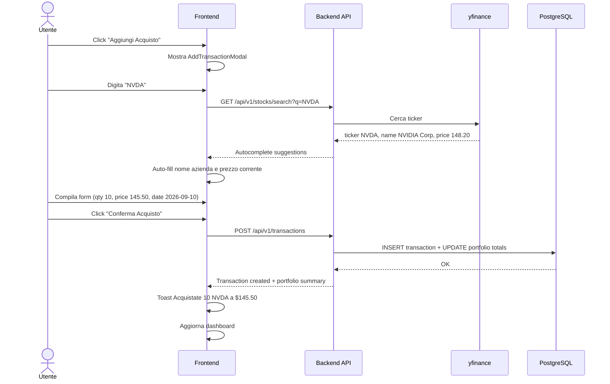
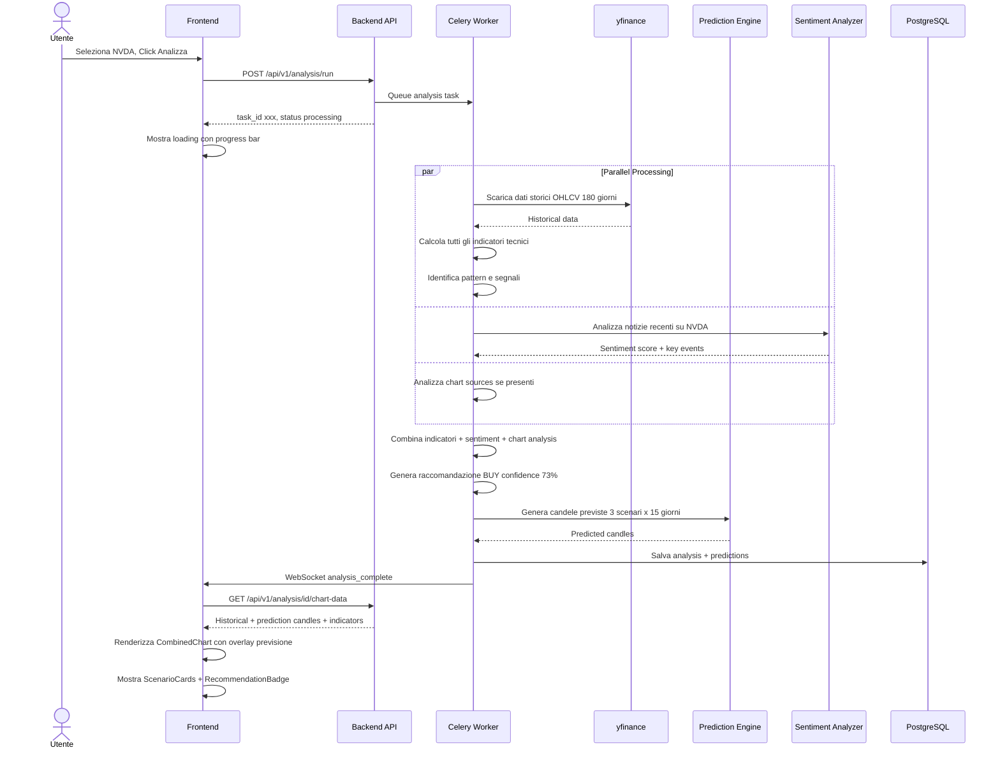
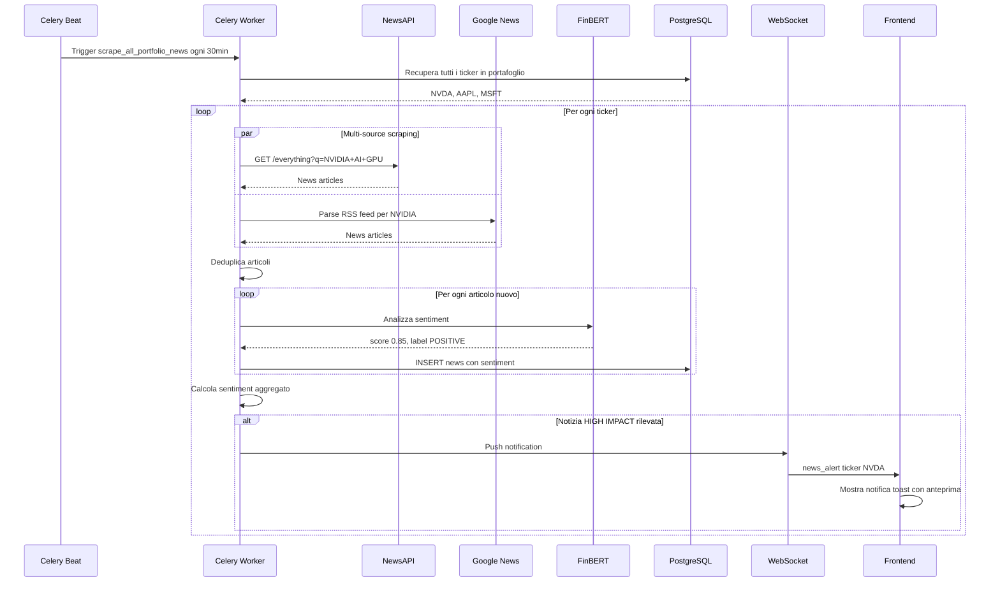

# 📊 TradeAnalyzer Pro — Specifica Tecnica Completa

**Versione Attuale:** v0.5.0

## Changelog
- **v0.5.0**: Risoluzione crash backend all'avvio su Uvicorn (`AttributeError: 'Settings' object has no attribute 'STORAGE_DIR'` in `RecursivePredictiveEngine`), definizione esplicita di `STORAGE_PATH` e `STORAGE_DIR` con fallback sicuri in `Settings` (`config.py`); implementazione autocompletamento istantaneo lato client a 0ms basato su catalogo completo di oltre 70 titoli italiani FTSE MIB e internazionali unito con ricerca Yahoo Search in tempo reale; gestione trasparente e dettagliata degli errori di rete e risposte HTTP non-JSON (502/504) con messaggi esplicativi; ottimizzazione timeout proxy Nginx per evitare blocchi delle connessioni.
- **v0.4.0**: Ripristino e visibilità immediata del portafoglio e delle ultime transazioni direttamente nella schermata Dashboard principale (oltre alla scheda dedicata Portfolio); risoluzione bug ricerca e autocompletamento titoli (aggiunta `urllib.parse` mancante in backend per chiamate Yahoo Search, estensione del catalogo offline a oltre 70 titoli italiani FTSE MIB e internazionali con sinonimi/alias, opzione manuale per ticker personalizzati, pre-popolamento automatico prezzo live da Yahoo Finance); debouncing ottimizzato a 150ms con selezione da tastiera (Enter); irrobustimento gestione valori nulli in `/api/v1/portfolios/summary` e `/api/v1/transactions/`.
- **v0.3.0**: Risoluzione blocco eliminazione posizioni (gestione sicura vincoli FK in cascata), protezione modale di inserimento (debouncing ricerca 250ms, prevenzione invio involontario con Enter, rimozione click-dismiss accidentale su overlay), configurazione proxy Vite per sviluppo locale, e allineamento globale numeri di versione.
- **v0.2.0**: Motore di apprendimento ricorsivo con backtesting giorno per giorno su storico a 2 anni (~504 sessioni), calibrazione pesi con feedback loss (trend, momentum, pattern candlestick, volatilità), notizie reali e link autentici verificati da Yahoo Finance/RSS, autocompletamento titoli reali con quotazioni in tempo reale, grafici limitati ai soli titoli registrati in portafoglio.
- **v0.1.0**: Setup infrastruttura base, Docker stack su porta 3090, mappatura volumi su `/srv/docker_conf/trade` (`/strategies`, `/knowledge`, `/outputs`, `/results`, `/backtests`, `/news_cache`, `/postgres_data`, `/redis_data`), frontend reattivo e interattivo con navigazione completa (Dashboard con candele reali e forecast sovrapposto, Transazioni & Portafoglio con dialog modale, Fonti grafici esterne, Knowledge Engine con catalogo strategie e 60+ pattern candlestick, Notizie & Sentiment AI FinBERT, Pagina stato archiviazione persistente).
- **v0.0.1**: Creazione documento specifiche iniziali (TRADING_APP_SPEC.md).

> **Versione**: 1.0  
> **Data**: 2026-09-14  
> **Target**: Webapp Docker-based per gestione portafoglio, analisi tecnica avanzata e previsioni di trading  

---

## 1. Overview del Progetto

### 1.1 Obiettivo
Realizzare una webapp completa che permetta di:
- Registrare e gestire un portafoglio azionario personale
- Inserire link a grafici e fonti esterne per l'analisi dei titoli
- Eseguire analisi tecniche sofisticate basate su strategie di trading professionali
- Monitorare costantemente le notizie online che possano influire sui titoli in portafoglio
- Visualizzare grafici con candele reali e candele previsionali sovrapposte
- Ricevere raccomandazioni operative (comprare / vendere / mantenere)

### 1.2 Filosofia di Design
- **Dark Mode** di default con palette professionale (stile Bloomberg Terminal / TradingView)
- UI moderna, responsiva, con micro-animazioni e transizioni fluide
- Dashboard centralizzata con widget modulari
- Grafici interattivi ad alta fedeltà con candele giapponesi
- Esperienza utente premium e professionale

---

## 2. Architettura del Sistema

### 2.1 Stack Tecnologico

| Layer | Tecnologia | Motivazione |
|-------|-----------|-------------|
| **Frontend** | React 18+ con Vite | Performance, HMR, ecosystem maturo |
| **Charting** | Lightweight Charts (TradingView) + D3.js | Grafici finanziari professionali con candele |
| **Styling** | CSS Modules + CSS Custom Properties | Dark theme nativo, variabili di design system |
| **Backend API** | Python 3.11+ con FastAPI | Async nativo, performance, tipizzazione |
| **Database** | PostgreSQL 16 | Robustezza, JSON support, full-text search |
| **ORM** | SQLAlchemy 2.0 + Alembic | Migrations, type safety |
| **Cache** | Redis 7 | Cache notizie, rate limiting, sessioni |
| **Task Queue** | Celery + Redis (broker) | Job asincroni: scraping notizie, analisi |
| **Web Scraping** | BeautifulSoup4 + Playwright | Parsing HTML + rendering JS per grafici |
| **Market Data** | yfinance + Alpha Vantage API | Dati storici e real-time dei titoli |
| **AI/ML Analysis** | scikit-learn + pandas-ta + Prophet | Analisi tecnica e previsioni |
| **News Aggregation** | NewsAPI + Google News RSS + GDELT | Notizie multi-fonte |
| **NLP Sentiment** | transformers (FinBERT) | Sentiment analysis finanziario |
| **Container** | Docker + Docker Compose | Deploy isolato e riproducibile |

### 2.2 Diagramma Architetturale

```
┌─────────────────────────────────────────────────────────────────┐
│                        DOCKER COMPOSE                           │
│                                                                 │
│  ┌──────────────┐    ┌──────────────┐    ┌──────────────────┐   │
│  │   FRONTEND   │    │   BACKEND    │    │   CELERY WORKER  │   │
│  │  React+Vite  │◄──►│   FastAPI    │◄──►│  (Async Tasks)   │   │
│  │  :3000       │    │  :8000       │    │                  │   │
│  └──────────────┘    └──────┬───────┘    └────────┬─────────┘   │
│                             │                      │             │
│                      ┌──────┴───────┐       ┌──────┴─────────┐  │
│                      │  PostgreSQL  │       │     Redis       │  │
│                      │  :5432       │       │     :6379       │  │
│                      └──────────────┘       └────────────────┘  │
│                                                                 │
│  ┌──────────────────────────────────────────────────────────┐   │
│  │                    CELERY BEAT                            │   │
│  │  (Scheduler: news scraping, analisi periodiche)          │   │
│  └──────────────────────────────────────────────────────────┘   │
└─────────────────────────────────────────────────────────────────┘
                              │
                    ┌─────────┴─────────┐
                    │   EXTERNAL APIs    │
                    │  - yfinance        │
                    │  - Alpha Vantage   │
                    │  - NewsAPI         │
                    │  - Google News     │
                    │  - GDELT           │
                    └───────────────────┘
```

### 2.3 Docker Compose — Struttura Servizi

```yaml
# docker-compose.yml
version: "3.9"

services:
  # === DATABASE ===
  db:
    image: postgres:16-alpine
    restart: always
    environment:
      POSTGRES_DB: tradeanalyzer
      POSTGRES_USER: trader
      POSTGRES_PASSWORD: ${DB_PASSWORD}
    volumes:
      - postgres_data:/var/lib/postgresql/data
      - ./backend/db/init.sql:/docker-entrypoint-initdb.d/init.sql
    ports:
      - "5432:5432"
    healthcheck:
      test: ["CMD-SHELL", "pg_isready -U trader -d tradeanalyzer"]
      interval: 10s
      timeout: 5s
      retries: 5

  # === CACHE & MESSAGE BROKER ===
  redis:
    image: redis:7-alpine
    restart: always
    ports:
      - "6379:6379"
    volumes:
      - redis_data:/data
    healthcheck:
      test: ["CMD", "redis-cli", "ping"]
      interval: 10s
      timeout: 5s
      retries: 5

  # === BACKEND API ===
  backend:
    build:
      context: ./backend
      dockerfile: Dockerfile
    restart: always
    environment:
      DATABASE_URL: postgresql+asyncpg://trader:${DB_PASSWORD}@db:5432/tradeanalyzer
      REDIS_URL: redis://redis:6379/0
      ALPHA_VANTAGE_API_KEY: ${ALPHA_VANTAGE_API_KEY}
      NEWS_API_KEY: ${NEWS_API_KEY}
      OPENAI_API_KEY: ${OPENAI_API_KEY}  # opzionale, per analisi AI avanzate
      SECRET_KEY: ${SECRET_KEY}
    ports:
      - "8000:8000"
    depends_on:
      db:
        condition: service_healthy
      redis:
        condition: service_healthy
    volumes:
      - ./backend:/app
      - chart_screenshots:/app/screenshots

  # === CELERY WORKER ===
  celery_worker:
    build:
      context: ./backend
      dockerfile: Dockerfile
    restart: always
    command: celery -A app.workers.celery_app worker --loglevel=info --concurrency=4
    environment:
      DATABASE_URL: postgresql+asyncpg://trader:${DB_PASSWORD}@db:5432/tradeanalyzer
      REDIS_URL: redis://redis:6379/0
      ALPHA_VANTAGE_API_KEY: ${ALPHA_VANTAGE_API_KEY}
      NEWS_API_KEY: ${NEWS_API_KEY}
    depends_on:
      - backend
      - redis
    volumes:
      - chart_screenshots:/app/screenshots

  # === CELERY BEAT (SCHEDULER) ===
  celery_beat:
    build:
      context: ./backend
      dockerfile: Dockerfile
    restart: always
    command: celery -A app.workers.celery_app beat --loglevel=info
    environment:
      DATABASE_URL: postgresql+asyncpg://trader:${DB_PASSWORD}@db:5432/tradeanalyzer
      REDIS_URL: redis://redis:6379/0
    depends_on:
      - backend
      - redis

  # === FRONTEND ===
  frontend:
    build:
      context: ./frontend
      dockerfile: Dockerfile
    restart: always
    ports:
      - "3000:3000"
    depends_on:
      - backend
    environment:
      VITE_API_URL: http://backend:8000

volumes:
  postgres_data:
  redis_data:
  chart_screenshots:
```

---

## 3. Struttura del Progetto (File System)

```
trade-analyzer-pro/
├── docker-compose.yml
├── .env                          # Variabili d'ambiente (API keys, passwords)
├── .env.example                  # Template delle variabili
├── README.md
│
├── backend/
│   ├── Dockerfile
│   ├── requirements.txt
│   ├── alembic.ini
│   ├── alembic/
│   │   └── versions/            # Migration files
│   │
│   ├── app/
│   │   ├── __init__.py
│   │   ├── main.py              # FastAPI app entry point
│   │   ├── config.py            # Settings & environment config
│   │   ├── dependencies.py      # Dependency injection
│   │   │
│   │   ├── models/              # SQLAlchemy Models
│   │   │   ├── __init__.py
│   │   │   ├── base.py          # Base model con timestamp
│   │   │   ├── portfolio.py     # Modello Portfolio
│   │   │   ├── stock.py         # Modello Stock/Azione
│   │   │   ├── transaction.py   # Modello Transazione (buy/sell)
│   │   │   ├── chart_source.py  # Modello Fonti Grafici
│   │   │   ├── news.py          # Modello Notizie raccolte
│   │   │   ├── analysis.py      # Modello Risultati Analisi
│   │   │   └── prediction.py    # Modello Previsioni
│   │   │
│   │   ├── schemas/             # Pydantic Schemas (request/response)
│   │   │   ├── __init__.py
│   │   │   ├── portfolio.py
│   │   │   ├── stock.py
│   │   │   ├── transaction.py
│   │   │   ├── chart_source.py
│   │   │   ├── news.py
│   │   │   ├── analysis.py
│   │   │   └── prediction.py
│   │   │
│   │   ├── api/                 # API Routes
│   │   │   ├── __init__.py
│   │   │   ├── router.py        # Router principale
│   │   │   ├── portfolio.py     # CRUD portafoglio
│   │   │   ├── stocks.py        # Gestione titoli
│   │   │   ├── transactions.py  # Registrazione acquisti/vendite
│   │   │   ├── chart_sources.py # Gestione fonti grafici
│   │   │   ├── analysis.py      # Lancio e risultati analisi
│   │   │   ├── predictions.py   # Previsioni e scenari
│   │   │   └── news.py          # Notizie e sentiment
│   │   │
│   │   ├── services/            # Business Logic
│   │   │   ├── __init__.py
│   │   │   ├── market_data.py   # Recupero dati di mercato (yfinance, Alpha Vantage)
│   │   │   ├── chart_analyzer.py    # Analisi grafici da link esterni
│   │   │   ├── technical_analysis.py # Strategie di trading
│   │   │   ├── prediction_engine.py  # Motore previsionale
│   │   │   ├── news_scraper.py      # Scraping notizie
│   │   │   ├── sentiment_analyzer.py # NLP sentiment analysis
│   │   │   ├── recommendation.py    # Motore raccomandazioni
│   │   │   └── chart_generator.py   # Generazione grafici con previsioni
│   │   │
│   │   ├── workers/             # Celery Tasks
│   │   │   ├── __init__.py
│   │   │   ├── celery_app.py    # Configurazione Celery
│   │   │   ├── news_tasks.py    # Task scraping notizie periodico
│   │   │   ├── analysis_tasks.py # Task analisi pianificate
│   │   │   └── market_tasks.py  # Task aggiornamento prezzi
│   │   │
│   │   └── utils/
│   │       ├── __init__.py
│   │       ├── indicators.py    # Calcolo indicatori tecnici
│   │       └── helpers.py       # Utility varie
│   │
│   └── db/
│       └── init.sql             # Script inizializzazione DB
│
├── frontend/
│   ├── Dockerfile
│   ├── nginx.conf               # Config Nginx per production
│   ├── package.json
│   ├── vite.config.js
│   ├── index.html
│   │
│   ├── public/
│   │   └── favicon.svg
│   │
│   └── src/
│       ├── main.jsx             # Entry point React
│       ├── App.jsx              # App root con routing
│       ├── index.css            # Design system globale + dark theme
│       │
│       ├── api/                 # API client layer
│       │   ├── client.js        # Axios/fetch configurato
│       │   ├── portfolio.js
│       │   ├── stocks.js
│       │   ├── transactions.js
│       │   ├── chartSources.js
│       │   ├── analysis.js
│       │   ├── predictions.js
│       │   └── news.js
│       │
│       ├── components/          # Componenti riutilizzabili
│       │   ├── Layout/
│       │   │   ├── Sidebar.jsx
│       │   │   ├── TopBar.jsx
│       │   │   └── Layout.jsx
│       │   ├── Charts/
│       │   │   ├── CandlestickChart.jsx      # Grafico candele reali
│       │   │   ├── PredictionOverlay.jsx      # Overlay candele previste
│       │   │   ├── CombinedChart.jsx          # Grafico combinato reale+previsione
│       │   │   ├── VolumeChart.jsx            # Grafico volumi
│       │   │   └── IndicatorOverlay.jsx       # Overlay indicatori tecnici
│       │   ├── Portfolio/
│       │   │   ├── PortfolioSummary.jsx       # Riepilogo portafoglio
│       │   │   ├── StockCard.jsx              # Card singolo titolo
│       │   │   ├── AddTransactionModal.jsx    # Modal aggiunta acquisto
│       │   │   └── PortfolioTable.jsx         # Tabella dettagliata
│       │   ├── Analysis/
│       │   │   ├── AnalysisPanel.jsx          # Pannello analisi
│       │   │   ├── StrategySelector.jsx       # Selezione strategia
│       │   │   ├── ScenarioCards.jsx          # Card scenari possibili
│       │   │   └── RecommendationBadge.jsx    # Badge BUY/SELL/HOLD
│       │   ├── News/
│       │   │   ├── NewsFeed.jsx               # Feed notizie
│       │   │   ├── NewsCard.jsx               # Singola notizia
│       │   │   └── SentimentGauge.jsx         # Indicatore sentiment
│       │   └── Common/
│       │       ├── Button.jsx
│       │       ├── Modal.jsx
│       │       ├── LoadingSpinner.jsx
│       │       ├── Badge.jsx
│       │       ├── Card.jsx
│       │       └── Toast.jsx
│       │
│       ├── pages/               # Pagine principali
│       │   ├── Dashboard.jsx            # Dashboard principale
│       │   ├── PortfolioPage.jsx        # Gestione portafoglio
│       │   ├── AnalysisPage.jsx         # Pagina analisi con grafici
│       │   ├── PredictionsPage.jsx      # Previsioni e scenari
│       │   ├── NewsPage.jsx             # Feed notizie e sentiment
│       │   └── ChartSourcesPage.jsx     # Gestione fonti grafici
│       │
│       ├── hooks/               # Custom React Hooks
│       │   ├── usePortfolio.js
│       │   ├── useAnalysis.js
│       │   ├── useNews.js
│       │   └── useWebSocket.js  # Real-time updates
│       │
│       ├── context/             # React Context
│       │   ├── PortfolioContext.jsx
│       │   └── ThemeContext.jsx
│       │
│       └── utils/
│           ├── formatters.js    # Formattazione valute, date, percentuali
│           └── constants.js     # Costanti app
│
└── docs/
    ├── API.md                   # Documentazione API
    └── SETUP.md                 # Guida setup e deployment
```

---

## 4. Database Schema

### 4.1 Entity-Relationship Diagram

```
┌─────────────┐       ┌──────────────────┐       ┌──────────────────┐
│  portfolio   │       │   stock          │       │   transaction    │
├─────────────┤       ├──────────────────┤       ├──────────────────┤
│ id (PK)     │──┐    │ id (PK)          │──┐    │ id (PK)          │
│ name        │  │    │ ticker           │  │    │ stock_id (FK)    │
│ description │  │    │ company_name     │  │    │ portfolio_id(FK) │
│ created_at  │  │    │ sector           │  │    │ type (BUY/SELL)  │
│ updated_at  │  │    │ exchange         │  │    │ quantity         │
└─────────────┘  │    │ currency         │  │    │ price_per_share  │
                 │    │ current_price    │  │    │ total_cost       │
                 │    │ last_updated     │  │    │ commission       │
                 │    │ created_at       │  │    │ transaction_date │
                 │    └──────────────────┘  │    │ notes            │
                 │                          │    │ created_at       │
                 │                          │    └──────────────────┘
                 │
                 │    ┌──────────────────┐       ┌──────────────────┐
                 │    │  chart_source    │       │    news          │
                 │    ├──────────────────┤       ├──────────────────┤
                 └───►│ id (PK)          │       │ id (PK)          │
                      │ stock_id (FK)    │       │ stock_id (FK)    │
                      │ portfolio_id(FK) │       │ title            │
                      │ url              │       │ source           │
                      │ source_name      │       │ url              │
                      │ chart_type       │       │ summary          │
                      │ description      │       │ sentiment_score  │
                      │ last_scraped     │       │ sentiment_label  │
                      │ screenshot_path  │       │ published_at     │
                      │ created_at       │       │ relevance_score  │
                      └──────────────────┘       │ created_at       │
                                                 └──────────────────┘

┌──────────────────┐       ┌──────────────────────┐
│    analysis      │       │    prediction         │
├──────────────────┤       ├──────────────────────┤
│ id (PK)          │       │ id (PK)               │
│ stock_id (FK)    │──────►│ analysis_id (FK)      │
│ portfolio_id(FK) │       │ stock_id (FK)         │
│ strategy_used    │       │ predicted_date        │
│ timeframe        │       │ predicted_open        │
│ indicators_json  │       │ predicted_high        │
│ signals_json     │       │ predicted_low         │
│ recommendation   │       │ predicted_close       │
│ confidence_score │       │ predicted_volume      │
│ summary          │       │ confidence            │
│ scenarios_json   │       │ scenario_type         │
│ news_impact_json │       │ created_at            │
│ created_at       │       └──────────────────────┘
└──────────────────┘
```

### 4.2 SQL Schema Dettagliato

```sql
-- === PORTFOLIO ===
CREATE TABLE portfolio (
    id              UUID PRIMARY KEY DEFAULT gen_random_uuid(),
    name            VARCHAR(255) NOT NULL,
    description     TEXT,
    total_invested  DECIMAL(15, 2) DEFAULT 0,
    total_value     DECIMAL(15, 2) DEFAULT 0,
    created_at      TIMESTAMP WITH TIME ZONE DEFAULT NOW(),
    updated_at      TIMESTAMP WITH TIME ZONE DEFAULT NOW()
);

-- === STOCK ===
CREATE TABLE stock (
    id              UUID PRIMARY KEY DEFAULT gen_random_uuid(),
    ticker          VARCHAR(20) NOT NULL UNIQUE,
    company_name    VARCHAR(500) NOT NULL,
    sector          VARCHAR(255),
    industry        VARCHAR(255),
    exchange        VARCHAR(50),
    currency        VARCHAR(10) DEFAULT 'USD',
    current_price   DECIMAL(15, 4),
    day_change_pct  DECIMAL(8, 4),
    market_cap      BIGINT,
    last_updated    TIMESTAMP WITH TIME ZONE,
    metadata_json   JSONB,                     -- Dati extra da yfinance
    created_at      TIMESTAMP WITH TIME ZONE DEFAULT NOW()
);

CREATE INDEX idx_stock_ticker ON stock(ticker);

-- === TRANSACTION (Acquisti/Vendite) ===
CREATE TABLE transaction (
    id                UUID PRIMARY KEY DEFAULT gen_random_uuid(),
    portfolio_id      UUID NOT NULL REFERENCES portfolio(id) ON DELETE CASCADE,
    stock_id          UUID NOT NULL REFERENCES stock(id) ON DELETE CASCADE,
    type              VARCHAR(10) NOT NULL CHECK (type IN ('BUY', 'SELL')),
    quantity          DECIMAL(15, 6) NOT NULL,
    price_per_share   DECIMAL(15, 4) NOT NULL,
    total_cost        DECIMAL(15, 2) NOT NULL,  -- quantity * price_per_share
    commission        DECIMAL(10, 2) DEFAULT 0,
    transaction_date  DATE NOT NULL,
    notes             TEXT,
    created_at        TIMESTAMP WITH TIME ZONE DEFAULT NOW()
);

CREATE INDEX idx_transaction_portfolio ON transaction(portfolio_id);
CREATE INDEX idx_transaction_stock ON transaction(stock_id);
CREATE INDEX idx_transaction_date ON transaction(transaction_date);

-- === CHART SOURCE (Fonti Grafici) ===
CREATE TABLE chart_source (
    id              UUID PRIMARY KEY DEFAULT gen_random_uuid(),
    stock_id        UUID NOT NULL REFERENCES stock(id) ON DELETE CASCADE,
    portfolio_id    UUID REFERENCES portfolio(id) ON DELETE SET NULL,
    url             TEXT NOT NULL,
    source_name     VARCHAR(255),              -- es. "TradingView", "Yahoo Finance"
    chart_type      VARCHAR(50),               -- es. "candlestick", "line", "bar"
    timeframe       VARCHAR(20),               -- es. "1D", "1W", "1M"
    description     TEXT,
    screenshot_path VARCHAR(500),              -- Path screenshot catturato
    ocr_data_json   JSONB,                     -- Dati estratti via OCR/scraping
    last_scraped    TIMESTAMP WITH TIME ZONE,
    is_active       BOOLEAN DEFAULT true,
    created_at      TIMESTAMP WITH TIME ZONE DEFAULT NOW()
);

CREATE INDEX idx_chart_source_stock ON chart_source(stock_id);

-- === NEWS ===
CREATE TABLE news (
    id              UUID PRIMARY KEY DEFAULT gen_random_uuid(),
    stock_id        UUID REFERENCES stock(id) ON DELETE CASCADE,
    title           TEXT NOT NULL,
    source          VARCHAR(255),              -- es. "Reuters", "Bloomberg"
    url             TEXT,
    summary         TEXT,
    full_content    TEXT,
    sentiment_score DECIMAL(5, 4),             -- da -1.0 (bearish) a +1.0 (bullish)
    sentiment_label VARCHAR(20),               -- POSITIVE, NEGATIVE, NEUTRAL
    relevance_score DECIMAL(5, 4),             -- 0.0 a 1.0
    impact_level    VARCHAR(20),               -- HIGH, MEDIUM, LOW
    categories      TEXT[],                    -- Array di categorie
    published_at    TIMESTAMP WITH TIME ZONE,
    scraped_at      TIMESTAMP WITH TIME ZONE DEFAULT NOW(),
    created_at      TIMESTAMP WITH TIME ZONE DEFAULT NOW()
);

CREATE INDEX idx_news_stock ON news(stock_id);
CREATE INDEX idx_news_published ON news(published_at DESC);
CREATE INDEX idx_news_sentiment ON news(sentiment_label);

-- === ANALYSIS ===
CREATE TABLE analysis (
    id                UUID PRIMARY KEY DEFAULT gen_random_uuid(),
    stock_id          UUID NOT NULL REFERENCES stock(id) ON DELETE CASCADE,
    portfolio_id      UUID REFERENCES portfolio(id) ON DELETE SET NULL,
    strategy_used     VARCHAR(100) NOT NULL,     -- Nome strategia
    timeframe         VARCHAR(20) NOT NULL,      -- "1D", "1W", "1M", "3M"
    
    -- Indicatori Tecnici calcolati
    indicators_json   JSONB NOT NULL,            -- Tutti gli indicatori calcolati
    /*
      Esempio indicators_json:
      {
        "sma_20": 145.30,
        "sma_50": 142.15,
        "sma_200": 138.90,
        "ema_12": 146.20,
        "ema_26": 143.50,
        "rsi_14": 62.5,
        "macd": {"macd": 2.7, "signal": 1.9, "histogram": 0.8},
        "bollinger": {"upper": 155.0, "middle": 145.0, "lower": 135.0},
        "stochastic": {"k": 72.3, "d": 68.1},
        "atr_14": 3.45,
        "obv": 125000000,
        "vwap": 146.80,
        "fibonacci_levels": {...},
        "ichimoku": {...},
        "adx": 28.5,
        "pivot_points": {...}
      }
    */
    
    -- Segnali rilevati
    signals_json      JSONB,
    /*
      Esempio signals_json:
      {
        "golden_cross": false,
        "death_cross": false,
        "rsi_oversold": false,
        "rsi_overbought": false,
        "macd_crossover": true,
        "bollinger_squeeze": false,
        "volume_breakout": true,
        "support_bounce": true,
        "resistance_rejection": false,
        "trend_direction": "BULLISH",
        "trend_strength": "MODERATE"
      }
    */
    
    -- Raccomandazione
    recommendation    VARCHAR(20) NOT NULL,      -- STRONG_BUY, BUY, HOLD, SELL, STRONG_SELL
    confidence_score  DECIMAL(5, 4) NOT NULL,    -- 0.0 a 1.0
    
    -- Sintesi
    summary           TEXT NOT NULL,             -- Riassunto in linguaggio naturale
    detailed_report   TEXT,                      -- Report dettagliato
    
    -- Scenari
    scenarios_json    JSONB,
    /*
      Esempio scenarios_json:
      {
        "bullish": {
          "probability": 0.45,
          "target_price": 165.0,
          "description": "Rottura resistenza a 155...",
          "timeframe": "2-4 settimane",
          "catalysts": ["Earnings positivi", "Momentum settoriale"]
        },
        "neutral": {
          "probability": 0.35,
          "target_price": 148.0,
          "description": "Consolidamento laterale...",
          "timeframe": "1-2 settimane",
          "catalysts": []
        },
        "bearish": {
          "probability": 0.20,
          "target_price": 132.0,
          "description": "Rottura supporto a 140...",
          "timeframe": "1-3 settimane",
          "catalysts": ["Dati macro negativi"]
        }
      }
    */
    
    -- Impatto notizie sull'analisi
    news_impact_json  JSONB,
    /*
      Esempio news_impact_json:
      {
        "overall_sentiment": 0.35,
        "news_count": 12,
        "key_events": [
          {"title": "...", "impact": "HIGH", "sentiment": 0.8},
          ...
        ],
        "sector_trend": "POSITIVE"
      }
    */
    
    created_at        TIMESTAMP WITH TIME ZONE DEFAULT NOW()
);

CREATE INDEX idx_analysis_stock ON analysis(stock_id);
CREATE INDEX idx_analysis_created ON analysis(created_at DESC);

-- === PREDICTION (Candele Previste) ===
CREATE TABLE prediction (
    id              UUID PRIMARY KEY DEFAULT gen_random_uuid(),
    analysis_id     UUID NOT NULL REFERENCES analysis(id) ON DELETE CASCADE,
    stock_id        UUID NOT NULL REFERENCES stock(id) ON DELETE CASCADE,
    scenario_type   VARCHAR(20) NOT NULL,        -- BULLISH, NEUTRAL, BEARISH
    predicted_date  DATE NOT NULL,
    predicted_open  DECIMAL(15, 4) NOT NULL,
    predicted_high  DECIMAL(15, 4) NOT NULL,
    predicted_low   DECIMAL(15, 4) NOT NULL,
    predicted_close DECIMAL(15, 4) NOT NULL,
    predicted_volume BIGINT,
    confidence      DECIMAL(5, 4) NOT NULL,      -- 0.0 a 1.0
    created_at      TIMESTAMP WITH TIME ZONE DEFAULT NOW()
);

CREATE INDEX idx_prediction_analysis ON prediction(analysis_id);
CREATE INDEX idx_prediction_stock ON prediction(stock_id);
CREATE INDEX idx_prediction_date ON prediction(predicted_date);
```

---

## 5. API Endpoints — Specifica Completa

### 5.1 Portfolio Management

| Method | Endpoint | Descrizione |
|--------|----------|-------------|
| `GET` | `/api/v1/portfolios` | Lista tutti i portafogli |
| `POST` | `/api/v1/portfolios` | Crea nuovo portafoglio |
| `GET` | `/api/v1/portfolios/{id}` | Dettaglio portafoglio con summary |
| `PUT` | `/api/v1/portfolios/{id}` | Aggiorna portafoglio |
| `DELETE` | `/api/v1/portfolios/{id}` | Elimina portafoglio |
| `GET` | `/api/v1/portfolios/{id}/performance` | Performance: P&L, rendimento % |

### 5.2 Stock & Transactions

| Method | Endpoint | Descrizione |
|--------|----------|-------------|
| `GET` | `/api/v1/stocks` | Lista titoli registrati |
| `POST` | `/api/v1/stocks` | Registra nuovo titolo (auto-fill da yfinance) |
| `GET` | `/api/v1/stocks/{ticker}` | Dettaglio titolo con prezzo corrente |
| `GET` | `/api/v1/stocks/{ticker}/history` | Dati storici OHLCV |
| `POST` | `/api/v1/transactions` | **Registra acquisto/vendita** |
| `GET` | `/api/v1/transactions` | Lista transazioni (filtri: portfolio, stock, date) |
| `GET` | `/api/v1/transactions/{id}` | Dettaglio transazione |
| `PUT` | `/api/v1/transactions/{id}` | Modifica transazione |
| `DELETE` | `/api/v1/transactions/{id}` | Elimina transazione |

#### Esempio Request — Registra Acquisto

```json
POST /api/v1/transactions
{
  "portfolio_id": "uuid-del-portafoglio",
  "ticker": "NVDA",
  "type": "BUY",
  "quantity": 10,
  "price_per_share": 145.50,
  "commission": 2.99,
  "transaction_date": "2026-09-10",
  "notes": "Acquisto post-correzione, RSI in zona oversold"
}
```

#### Esempio Response

```json
{
  "id": "uuid-transazione",
  "portfolio_id": "uuid-portafoglio",
  "stock": {
    "ticker": "NVDA",
    "company_name": "NVIDIA Corporation",
    "sector": "Technology",
    "current_price": 148.20,
    "day_change_pct": 2.15
  },
  "type": "BUY",
  "quantity": 10,
  "price_per_share": 145.50,
  "total_cost": 1455.00,
  "commission": 2.99,
  "transaction_date": "2026-09-10",
  "current_value": 1482.00,
  "unrealized_pnl": 27.00,
  "unrealized_pnl_pct": 1.86,
  "notes": "Acquisto post-correzione, RSI in zona oversold",
  "created_at": "2026-09-10T14:30:00Z"
}
```

### 5.3 Chart Sources

| Method | Endpoint | Descrizione |
|--------|----------|-------------|
| `POST` | `/api/v1/chart-sources` | **Aggiungi link a fonte grafico** |
| `GET` | `/api/v1/chart-sources` | Lista fonti per titolo |
| `GET` | `/api/v1/chart-sources/{id}` | Dettaglio fonte con screenshot |
| `POST` | `/api/v1/chart-sources/{id}/scrape` | Forza re-scraping del grafico |
| `DELETE` | `/api/v1/chart-sources/{id}` | Rimuovi fonte |

#### Esempio Request — Aggiungi Fonte Grafico

```json
POST /api/v1/chart-sources
{
  "ticker": "NVDA",
  "url": "https://www.tradingview.com/chart/NVDA/",
  "source_name": "TradingView",
  "chart_type": "candlestick",
  "timeframe": "1D",
  "description": "Grafico giornaliero TradingView con indicatori"
}
```

### 5.4 Analysis & Predictions

| Method | Endpoint | Descrizione |
|--------|----------|-------------|
| `POST` | `/api/v1/analysis/run` | **Lancia analisi completa su un titolo** |
| `POST` | `/api/v1/analysis/run-portfolio` | Lancia analisi su tutto il portafoglio |
| `GET` | `/api/v1/analysis/{id}` | Risultato analisi con scenari |
| `GET` | `/api/v1/analysis/stock/{ticker}` | Ultime analisi per titolo |
| `GET` | `/api/v1/analysis/{id}/predictions` | Candele previste per analisi |
| `GET` | `/api/v1/analysis/{id}/chart-data` | **Dati per grafico combinato (reale + previsione)** |
| `GET` | `/api/v1/predictions/stock/{ticker}` | Ultime previsioni per titolo |

#### Esempio Request — Lancia Analisi

```json
POST /api/v1/analysis/run
{
  "ticker": "NVDA",
  "portfolio_id": "uuid-portafoglio",
  "strategies": ["MULTI_INDICATOR", "ICHIMOKU", "ELLIOTT_WAVE"],
  "timeframe": "1D",
  "lookback_days": 180,
  "include_news_impact": true,
  "include_chart_sources": true,
  "prediction_days": 15
}
```

#### Esempio Response — Risultato Analisi Completo

```json
{
  "id": "uuid-analisi",
  "stock": {
    "ticker": "NVDA",
    "company_name": "NVIDIA Corporation",
    "current_price": 148.20
  },
  "strategy_used": "MULTI_INDICATOR",
  "timeframe": "1D",
  
  "recommendation": "BUY",
  "confidence_score": 0.73,
  
  "summary": "NVDA mostra segnali bullish con MACD crossover positivo, RSI a 58 (spazio di crescita), e prezzo sopra la SMA 50. Il volume è in aumento, confermando il momentum. Le notizie sul settore AI sono prevalentemente positive (sentiment 0.65). Si raccomanda ACQUISTO con target a 165 e stop-loss a 138.",
  
  "indicators": {
    "sma_20": 145.30,
    "sma_50": 142.15,
    "sma_200": 138.90,
    "rsi_14": 58.2,
    "macd": {"macd": 2.7, "signal": 1.9, "histogram": 0.8},
    "bollinger": {"upper": 158.0, "middle": 145.0, "lower": 132.0},
    "atr_14": 4.2,
    "adx": 32.1,
    "stochastic": {"k": 65.3, "d": 61.8}
  },
  
  "signals": {
    "macd_crossover": true,
    "golden_cross": false,
    "rsi_oversold": false,
    "bollinger_squeeze": false,
    "volume_breakout": true,
    "trend_direction": "BULLISH",
    "trend_strength": "MODERATE"
  },
  
  "scenarios": {
    "bullish": {
      "probability": 0.50,
      "target_price": 165.0,
      "stop_loss": 138.0,
      "risk_reward_ratio": 1.65,
      "timeframe": "2-4 settimane",
      "description": "Continuazione trend rialzista con target alla resistenza a 165. Il MACD in divergenza positiva e il volume crescente supportano lo scenario. Catalyst: risultati trimestrali AI superiori alle attese.",
      "catalysts": [
        "Momentum settore AI",
        "Earnings preview positivo",
        "Domanda GPU datacenter"
      ]
    },
    "neutral": {
      "probability": 0.30,
      "target_price": 150.0,
      "description": "Consolidamento nell'area 142-155. Il titolo potrebbe lateralizzare in attesa di catalyst fondamentali.",
      "timeframe": "1-2 settimane"
    },
    "bearish": {
      "probability": 0.20,
      "target_price": 130.0,
      "description": "Rottura del supporto a 140 con possibile test della SMA 200 a 138.90. Scenario attivato da presa di profitto generalizzata sul tech.",
      "timeframe": "1-3 settimane",
      "catalysts": [
        "Regolamentazione AI negativa",
        "Dati macro recessivi"
      ]
    }
  },
  
  "news_impact": {
    "overall_sentiment": 0.52,
    "total_news_analyzed": 28,
    "key_events": [
      {
        "title": "NVIDIA annuncia nuova GPU per datacenter AI",
        "sentiment": 0.85,
        "impact": "HIGH",
        "source": "Reuters"
      },
      {
        "title": "Regolatori UE valutano nuove norme sull'AI",
        "sentiment": -0.30,
        "impact": "MEDIUM",
        "source": "Financial Times"
      }
    ]
  },
  
  "predictions": [
    {
      "date": "2026-09-15",
      "scenario": "bullish",
      "open": 148.50, "high": 152.30, "low": 147.80, "close": 151.90,
      "confidence": 0.70
    },
    {
      "date": "2026-09-16",
      "scenario": "bullish",
      "open": 151.90, "high": 155.10, "low": 150.50, "close": 154.20,
      "confidence": 0.65
    }
  ],
  
  "chart_data": {
    "historical_candles": [],
    "prediction_candles_bullish": [],
    "prediction_candles_neutral": [],
    "prediction_candles_bearish": [],
    "indicator_overlays": {
      "sma_20": [],
      "sma_50": [],
      "bollinger_upper": [],
      "bollinger_lower": []
    }
  },
  
  "created_at": "2026-09-14T22:30:00Z"
}
```

### 5.5 News & Sentiment

| Method | Endpoint | Descrizione |
|--------|----------|-------------|
| `GET` | `/api/v1/news` | Feed notizie globali per il portafoglio |
| `GET` | `/api/v1/news/stock/{ticker}` | Notizie specifiche per titolo |
| `GET` | `/api/v1/news/sentiment/{ticker}` | Sentiment aggregato per titolo |
| `POST` | `/api/v1/news/refresh` | Forza refresh notizie |
| `GET` | `/api/v1/news/trends` | Trend topics che impattano il portafoglio |

### 5.6 WebSocket (Real-time Updates)

```
WS /ws/portfolio/{portfolio_id}
```

Eventi push in real-time:
- `price_update` — Aggiornamento prezzo titolo
- `news_alert` — Nuova notizia rilevante
- `analysis_complete` — Analisi completata
- `sentiment_change` — Cambio significativo sentiment

---

## 6. Strategie di Trading da Implementare

### 6.1 Indicatori Tecnici (tutti da calcolare via `pandas-ta`)

| Categoria | Indicatori |
|-----------|-----------|
| **Trend** | SMA (20, 50, 100, 200), EMA (12, 26, 50), MACD, ADX/DI+/DI-, Ichimoku Cloud, Parabolic SAR, Supertrend |
| **Momentum** | RSI (14), Stochastic Oscillator (%K, %D), Williams %R, CCI (Commodity Channel Index), ROC (Rate of Change), MFI (Money Flow Index) |
| **Volatilità** | Bollinger Bands (20, 2σ), ATR (14), Keltner Channel, Donchian Channel |
| **Volume** | OBV (On-Balance Volume), VWAP, A/D Line (Accumulation/Distribution), Chaikin Money Flow |
| **Supporto/Resistenza** | Fibonacci Retracement/Extension, Pivot Points (Standard, Camarilla, Woodie), Support/Resistance Levels |

### 6.2 Strategie Composite da Implementare

Ogni strategia produce una raccomandazione con confidence score.

#### Strategia 1: Multi-Indicator Confluence (DEFAULT)
```
Logica:
1. Calcola tutti gli indicatori nella tabella 6.1
2. Per ogni indicatore, genera un segnale: BULLISH (+1), NEUTRAL (0), BEARISH (-1)
3. Pesa i segnali:
   - Trend indicators: peso 2x (più importanti)
   - Momentum indicators: peso 1.5x
   - Volume indicators: peso 1.2x
   - Volatilità: peso 1x
4. Somma pesata → score finale normalizzato a [-1, +1]
5. Mappatura:
   - > 0.6  → STRONG_BUY
   - > 0.2  → BUY
   - > -0.2 → HOLD
   - > -0.6 → SELL
   - ≤ -0.6 → STRONG_SELL
6. Confidence = abs(score) * fattore_news_sentiment
```

#### Strategia 2: Ichimoku Cloud Strategy
```
Logica:
1. Calcola le 5 linee Ichimoku:
   - Tenkan-sen (Conversion Line): (9-period high + 9-period low) / 2
   - Kijun-sen (Base Line): (26-period high + 26-period low) / 2
   - Senkou Span A: (Tenkan + Kijun) / 2, proiettato 26 periodi avanti
   - Senkou Span B: (52-period high + 52-period low) / 2, proiettato 26 periodi avanti
   - Chikou Span: Close proiettato 26 periodi indietro
   
2. Segnali:
   - BUY: prezzo sopra la cloud, Tenkan > Kijun, Chikou sopra il prezzo
   - SELL: prezzo sotto la cloud, Tenkan < Kijun, Chikou sotto il prezzo
   - Cloud twist (cambio colore) = possibile inversione trend
   
3. Forza del segnale basata su quanti criteri sono soddisfatti
```

#### Strategia 3: Elliott Wave (Semplificata)
```
Logica:
1. Identifica pattern di onde usando ZigZag indicator
2. Classifica le onde:
   - Onde impulsive (1-2-3-4-5): trend principale
   - Onde correttive (A-B-C): correzione
3. Determina in quale onda si trova il prezzo corrente
4. Predici il movimento successivo basato sulla struttura delle onde
5. Calcola target usando rapporti di Fibonacci tra le onde
```

#### Strategia 4: Smart Money Concepts (SMC)
```
Logica:
1. Identifica:
   - Order Blocks (zone di accumulazione istituzionale)
   - Fair Value Gaps (FVG) — inefficienze di prezzo
   - Break of Structure (BoS) — rotture strutturali
   - Change of Character (ChoCH) — cambi di carattere
   - Liquidity pools (sopra/sotto swing highs/lows)
2. Determina il bias direzionale (bullish/bearish)
3. Identifica zone di entry ottimali
4. Calcola target basati sulla struttura di mercato
```

#### Strategia 5: Volume Profile Analysis
```
Logica:
1. Calcola il Volume Profile per il periodo selezionato
2. Identifica:
   - Point of Control (POC): livello di prezzo con più volume
   - Value Area High (VAH) e Value Area Low (VAL)
   - High Volume Nodes (HVN): zone di supporto/resistenza
   - Low Volume Nodes (LVN): zone di transizione rapida
3. Genera segnali basati sulla posizione del prezzo rispetto a POC e Value Area
```

#### Strategia 6: Divergence Scanner
```
Logica:
1. Cerca divergenze tra prezzo e oscillatori:
   - Regular Bullish Divergence: prezzo fa lower low, RSI fa higher low → BUY
   - Regular Bearish Divergence: prezzo fa higher high, RSI fa lower high → SELL
   - Hidden Bullish Divergence: prezzo fa higher low, RSI fa lower low → trend continuation
   - Hidden Bearish Divergence: prezzo fa lower high, RSI fa higher high → trend continuation
2. Verifica divergenze su: RSI, MACD, Stochastic, OBV
3. Più oscillatori confermano = segnale più forte
```

### 6.3 Motore di Previsione (Candele Previste)

Il sistema deve generare candele previste (OHLCV) per i prossimi N giorni. L'implementazione combina:

```python
# prediction_engine.py — Pseudo-implementazione

class PredictionEngine:
    """
    Genera candele previsionali combinando:
    1. Modello statistico (Prophet / ARIMA)
    2. Pattern recognition (candlestick patterns)
    3. Indicatori tecnici (proiezione trend)
    4. Sentiment news (modulazione)
    """
    
    def generate_predictions(
        self,
        ticker: str,
        historical_data: pd.DataFrame,    # OHLCV storico
        analysis_result: AnalysisResult,   # Risultato analisi tecnica
        news_sentiment: float,             # Sentiment aggregato
        prediction_days: int = 15,
        scenarios: list = ["bullish", "neutral", "bearish"]
    ) -> dict[str, list[PredictedCandle]]:
        
        predictions = {}
        
        for scenario in scenarios:
            # 1. Base prediction con Prophet/ARIMA
            base_forecast = self._statistical_forecast(
                historical_data, prediction_days
            )
            
            # 2. Aggiusta in base allo scenario
            adjusted = self._apply_scenario_bias(
                base_forecast, scenario, analysis_result
            )
            
            # 3. Genera candele OHLC realistiche da forecast
            candles = self._forecast_to_candles(
                adjusted, historical_data, scenario
            )
            
            # 4. Modula con sentiment notizie
            candles = self._apply_sentiment_modulation(
                candles, news_sentiment, scenario
            )
            
            # 5. Aggiungi volatilità realistica basata su ATR
            candles = self._add_realistic_volatility(
                candles, historical_data
            )
            
            predictions[scenario] = candles
        
        return predictions
    
    def _forecast_to_candles(self, forecast, historical, scenario):
        """
        Converte un forecast numerico in candele OHLCV realistiche.
        
        Per ogni giorno previsto:
        - close = valore previsto dal modello
        - open = close del giorno precedente (con small gap)
        - high = max(open, close) + random(0, ATR * volatility_factor)
        - low = min(open, close) - random(0, ATR * volatility_factor)
        - volume = media ultimi N giorni * volume_factor per scenario
        
        Il volatility_factor dipende dallo scenario:
        - bullish: tende a generare candele verdi (close > open)
        - bearish: tende a generare candele rosse (close < open)
        - neutral: mix bilanciato con range ridotto
        """
        pass
```

---

## 7. Sistema di Monitoraggio Notizie

### 7.1 Fonti Dati

| Fonte | Tipo | Endpoint/Metodo | Rate Limit |
|-------|------|-----------------|------------|
| **NewsAPI.org** | REST API | `GET /v2/everything?q={ticker}` | 100 req/day (free) |
| **Google News RSS** | RSS Feed | `https://news.google.com/rss/search?q={ticker}` | Nessuno |
| **GDELT Project** | REST API | `GET /api/v2/doc/doc?query={company}` | Generoso |
| **Yahoo Finance** | Web Scraping | `https://finance.yahoo.com/quote/{ticker}/news` | Rispettare robots.txt |
| **Reddit** (r/wallstreetbets, r/stocks) | API/Scraping | Reddit API | Rate limited |
| **Finviz** | Web Scraping | `https://finviz.com/quote.ashx?t={ticker}` | Rispettare robots.txt |

### 7.2 Celery Beat Schedule (Scraping Periodico)

```python
# celery_app.py

CELERY_BEAT_SCHEDULE = {
    # Scraping notizie ogni 30 minuti durante orari di mercato
    'scrape-news-market-hours': {
        'task': 'app.workers.news_tasks.scrape_all_portfolio_news',
        'schedule': crontab(minute='*/30', hour='8-22', day_of_week='1-5'),
    },
    
    # Scraping notizie ogni 2 ore fuori orario
    'scrape-news-off-hours': {
        'task': 'app.workers.news_tasks.scrape_all_portfolio_news',
        'schedule': crontab(minute=0, hour='0,2,4,6'),
    },
    
    # Aggiornamento prezzi ogni 5 minuti durante orari di mercato
    'update-prices': {
        'task': 'app.workers.market_tasks.update_stock_prices',
        'schedule': crontab(minute='*/5', hour='9-17', day_of_week='1-5'),
    },
    
    # Analisi sentiment aggregata ogni ora
    'aggregate-sentiment': {
        'task': 'app.workers.news_tasks.aggregate_sentiment',
        'schedule': crontab(minute=0),
    },
    
    # Scraping fonti grafici esterne ogni 6 ore
    'scrape-chart-sources': {
        'task': 'app.workers.analysis_tasks.scrape_chart_sources',
        'schedule': crontab(minute=0, hour='*/6'),
    },
    
    # Report giornaliero di portafoglio
    'daily-portfolio-report': {
        'task': 'app.workers.analysis_tasks.generate_daily_report',
        'schedule': crontab(minute=0, hour=18),  # Alle 18:00
    },
}
```

### 7.3 Sentiment Analysis Pipeline

```python
# sentiment_analyzer.py — Pipeline NLP

class SentimentAnalyzer:
    """
    Pipeline di analisi sentiment finanziario usando FinBERT.
    FinBERT è un modello BERT pre-addestrato su testi finanziari.
    """
    
    def __init__(self):
        # Modello: ProsusAI/finbert (HuggingFace)
        self.model = pipeline(
            "sentiment-analysis",
            model="ProsusAI/finbert",
            tokenizer="ProsusAI/finbert"
        )
    
    def analyze_article(self, text: str) -> SentimentResult:
        """
        Analizza un singolo articolo.
        
        Returns:
            SentimentResult:
                score: float [-1.0, +1.0]
                label: "POSITIVE" | "NEGATIVE" | "NEUTRAL"
                confidence: float [0.0, 1.0]
        """
        result = self.model(text[:512])  # FinBERT max 512 tokens
        
        label = result[0]['label']  # positive/negative/neutral
        score = result[0]['score']  # confidence
        
        # Converti in score numerico [-1, +1]
        if label == 'positive':
            sentiment_score = score
        elif label == 'negative':
            sentiment_score = -score
        else:
            sentiment_score = 0.0
        
        return SentimentResult(
            score=sentiment_score,
            label=label.upper(),
            confidence=score
        )
    
    def aggregate_sentiment(
        self,
        articles: list,
        decay_factor: float = 0.95  # Notizie vecchie pesano meno
    ):
        """
        Aggrega il sentiment di multiple notizie con decadimento temporale.
        Le notizie più recenti hanno peso maggiore.
        """
        pass
```

### 7.4 Keyword Intelligence per Titolo

Per ogni titolo in portafoglio, il sistema cerca notizie usando keyword intelligenti:

```python
NEWS_KEYWORDS_MAP = {
    "NVDA": {
        "primary": ["NVIDIA", "NVDA"],
        "sector": ["artificial intelligence", "AI chips", "GPU", "datacenter"],
        "competitors": ["AMD", "Intel", "Qualcomm"],
        "themes": ["machine learning", "deep learning", "generative AI", 
                    "semiconductor", "chip shortage", "CUDA"],
        "macro": ["tech regulation", "US-China trade", "CHIPS Act"]
    },
    "AAPL": {
        "primary": ["Apple", "AAPL"],
        "sector": ["iPhone", "iOS", "MacBook", "Apple Vision"],
        "competitors": ["Samsung", "Google Pixel", "Huawei"],
        "themes": ["consumer electronics", "app store", "services revenue"],
        "macro": ["consumer spending", "supply chain"]
    }
    # ... auto-generato per ogni titolo usando yfinance metadata
}
```

---

## 8. Frontend — Specifiche UI Dettagliate

### 8.1 Design System

```css
/* index.css — Design System Tokens */

:root {
  /* === PALETTE DARK THEME (Ispirata a Bloomberg/TradingView) === */
  
  /* Background */
  --bg-primary: #0a0e17;          /* Sfondo principale — quasi nero con sfumatura blu */
  --bg-secondary: #111827;         /* Card, pannelli */
  --bg-tertiary: #1a2332;          /* Elementi nested */
  --bg-surface: #1e293b;           /* Superfici elevate */
  --bg-hover: rgba(255, 255, 255, 0.05);
  
  /* Testo */
  --text-primary: #e2e8f0;
  --text-secondary: #94a3b8;
  --text-muted: #64748b;
  
  /* Accenti */
  --accent-primary: #3b82f6;       /* Blu principale */
  --accent-primary-glow: rgba(59, 130, 246, 0.3);
  --accent-secondary: #8b5cf6;     /* Viola */
  
  /* Trading Colors */
  --color-bullish: #22c55e;        /* Verde — candele rialziste */
  --color-bullish-bg: rgba(34, 197, 94, 0.1);
  --color-bearish: #ef4444;        /* Rosso — candele ribassiste */
  --color-bearish-bg: rgba(239, 68, 68, 0.1);
  --color-neutral: #f59e0b;        /* Ambra — neutrale */
  --color-neutral-bg: rgba(245, 158, 11, 0.1);
  
  /* Recommendations */
  --color-strong-buy: #10b981;     /* Emerald */
  --color-buy: #22c55e;            /* Green */
  --color-hold: #f59e0b;           /* Amber */
  --color-sell: #f97316;           /* Orange */
  --color-strong-sell: #ef4444;    /* Red */
  
  /* Prediction Candles (semi-trasparenti per sovrapposizione) */
  --pred-bullish: rgba(34, 197, 94, 0.4);
  --pred-bullish-border: rgba(34, 197, 94, 0.7);
  --pred-bearish: rgba(239, 68, 68, 0.4);
  --pred-bearish-border: rgba(239, 68, 68, 0.7);
  --pred-zone: rgba(139, 92, 246, 0.1);  /* Zona di previsione */
  
  /* Borders */
  --border-primary: rgba(255, 255, 255, 0.08);
  --border-accent: rgba(59, 130, 246, 0.3);
  
  /* Shadows & Effects */
  --shadow-sm: 0 1px 3px rgba(0, 0, 0, 0.3);
  --shadow-md: 0 4px 12px rgba(0, 0, 0, 0.4);
  --shadow-lg: 0 8px 32px rgba(0, 0, 0, 0.5);
  --shadow-glow: 0 0 20px var(--accent-primary-glow);
  --glassmorphism: backdrop-filter: blur(12px);
  
  /* Typography */
  --font-sans: 'Inter', 'SF Pro Display', -apple-system, sans-serif;
  --font-mono: 'JetBrains Mono', 'Fira Code', monospace;
  
  /* Spacing */
  --space-xs: 4px;
  --space-sm: 8px;
  --space-md: 16px;
  --space-lg: 24px;
  --space-xl: 32px;
  --space-2xl: 48px;
  
  /* Border Radius */
  --radius-sm: 6px;
  --radius-md: 10px;
  --radius-lg: 16px;
  --radius-xl: 24px;
  
  /* Transitions */
  --transition-fast: 150ms cubic-bezier(0.4, 0, 0.2, 1);
  --transition-base: 250ms cubic-bezier(0.4, 0, 0.2, 1);
  --transition-slow: 400ms cubic-bezier(0.4, 0, 0.2, 1);
}
```

### 8.2 Layout Pagine

#### Dashboard Principale
```
┌──────────────────────────────────────────────────────────────────┐
│  [Logo] TradeAnalyzer Pro          🔔 Notifiche  ⚙️ Settings    │
├────────┬─────────────────────────────────────────────────────────┤
│        │                                                         │
│  📊    │  ┌─────────────────────────────────────────────────┐    │
│ Dash   │  │  PORTFOLIO OVERVIEW                              │    │
│        │  │  Valore Totale: $45,230.50  |  P&L: +$3,210     │    │
│  💼    │  │  ███████████████████░░░░  Allocazione settore    │    │
│ Port.  │  └─────────────────────────────────────────────────┘    │
│        │                                                         │
│  📈    │  ┌────────────────────┐  ┌────────────────────────┐    │
│ Analisi│  │  TOP MOVERS         │  │  RACCOMANDAZIONI       │    │
│        │  │  NVDA  +3.2% ▲     │  │  NVDA → BUY  (73%)    │    │
│  🔮    │  │  AAPL  -1.1% ▼     │  │  AAPL → HOLD (58%)    │    │
│ Prev.  │  │  MSFT  +0.8% ▲     │  │  MSFT → BUY  (65%)    │    │
│        │  └────────────────────┘  └────────────────────────┘    │
│  📰    │                                                         │
│ News   │  ┌─────────────────────────────────────────────────┐    │
│        │  │  ULTIME NOTIZIE                                  │    │
│  🔗    │  │  🟢 NVIDIA annuncia partnership AI...  2h ago    │    │
│ Fonti  │  │  🟡 Fed mantiene tassi invariati...    4h ago    │    │
│        │  │  🔴 Tensioni US-China sui chip...      6h ago    │    │
│        │  └─────────────────────────────────────────────────┘    │
└────────┴─────────────────────────────────────────────────────────┘
```

#### Pagina Analisi (con Grafico Combinato)
```
┌──────────────────────────────────────────────────────────────────┐
│  📈 ANALISI: NVDA — NVIDIA Corporation                          │
├──────────────────────────────────────────────────────────────────┤
│                                                                  │
│  ┌────────────────────────────────────────────────────────────┐  │
│  │                                                            │  │
│  │   GRAFICO CANDELE + PREVISIONE                             │  │
│  │                                                            │  │
│  │   ████████                                                 │  │
│  │   ██ OHLC ██  ▓▓▓▓▓▓▓▓                                   │  │
│  │   ██ REALI ██ ▓▓ PREV ▓▓  (semi-trasparenti)              │  │
│  │   ████████    ▓▓ BULL ▓▓                                   │  │
│  │               ▓▓▓▓▓▓▓▓                                    │  │
│  │     ←— DATI STORICI —→│←— PREVISIONE —→                   │  │
│  │                        │  ░░ Zona previsione ░░            │  │
│  │   [Indicatori overlay: SMA 20/50/200, Bollinger]           │  │
│  │                                                            │  │
│  │   📊 Volume bars sottostanti                               │  │
│  │   ─────────────────────────────────────────                │  │
│  │   [Timeframe: 1D | 1W | 1M | 3M | 6M | 1Y]               │  │
│  │   [Scenario: 🟢 Bullish | 🟡 Neutral | 🔴 Bearish]       │  │
│  └────────────────────────────────────────────────────────────┘  │
│                                                                  │
│  ┌──────────────────┐  ┌──────────────────┐  ┌──────────────┐   │
│  │ 🟢 BULLISH       │  │ 🟡 NEUTRAL       │  │ 🔴 BEARISH   │   │
│  │ Prob: 50%        │  │ Prob: 30%        │  │ Prob: 20%    │   │
│  │ Target: $165     │  │ Target: $150     │  │ Target: $130 │   │
│  │ Timeline: 2-4w   │  │ Timeline: 1-2w   │  │ Timeline: 1-3w│  │
│  │ R:R = 1.65       │  │                  │  │              │   │
│  │ [Dettagli ▼]     │  │ [Dettagli ▼]     │  │ [Dettagli ▼] │   │
│  └──────────────────┘  └──────────────────┘  └──────────────┘   │
│                                                                  │
│  ┌────────────────────────────────────────────────────────────┐  │
│  │  ╔══════════════════════════════════════╗                  │  │
│  │  ║  RACCOMANDAZIONE:  ██ BUY ██  73%   ║                  │  │
│  │  ║  "NVDA mostra segnali bullish..."   ║                  │  │
│  │  ║  Stop-Loss: $138  |  Target: $165   ║                  │  │
│  │  ╚══════════════════════════════════════╝                  │  │
│  │                                                            │  │
│  │  Indicatori: RSI 58 | MACD ↑ | ADX 32 | BB mid           │  │
│  │  Segnali: MACD Crossover ✓ | Volume Breakout ✓            │  │
│  └────────────────────────────────────────────────────────────┘  │
│                                                                  │
│  ┌────────────────────────────────────────────────────────────┐  │
│  │  NEWS IMPACT                                               │  │
│  │  Sentiment: ████████████░░░░ 0.52 (Moderately Positive)   │  │
│  │  28 articoli analizzati nelle ultime 48h                   │  │
│  │                                                            │  │
│  │  🟢 HIGH "NVIDIA annuncia nuova GPU..."      Sent: +0.85  │  │
│  │  🟡 MED  "Regolatori UE valutano..."         Sent: -0.30  │  │
│  │  🟢 MED  "Crescita domanda datacenter..."    Sent: +0.70  │  │
│  └────────────────────────────────────────────────────────────┘  │
└──────────────────────────────────────────────────────────────────┘
```

### 8.3 Grafico Combinato — Specifiche di Implementazione

Il grafico è l'elemento più importante dell'applicazione. Deve usare **Lightweight Charts** (libreria open-source di TradingView).

```jsx
// CombinedChart.jsx — Specifiche implementative

/*
  STRUTTURA DEL GRAFICO COMBINATO:
  
  1. AREA STORICA (sinistra):
     - Candele OHLC standard con colori pieni
     - Verde (#22c55e) per candele rialziste (close > open)
     - Rosso (#ef4444) per candele ribassiste (close < open)
     - Overlay indicatori: SMA, Bollinger Bands come linee
     - Barre volume nella parte inferiore
  
  2. LINEA DIVISORIA:
     - Linea verticale tratteggiata che separa dati reali da previsioni
     - Label "OGGI" sulla linea
  
  3. AREA PREVISIONE (destra):
     - Background leggermente diverso (sfumatura viola semi-trasparente)
     - Candele previste con opacità ridotta (40-70%)
     - 3 serie di candele sovrapponibili (una per scenario)
     - Toggle per mostrare/nascondere ogni scenario
     - Banda di confidenza (area sfumata) intorno alle candele
     - Le candele previste usano colori con alpha:
       Bullish scenario: verde con opacità
       Bearish scenario: rosso con opacità
       Neutral scenario: ambra con opacità
  
  4. CONTROLLI:
     - Dropdown scenario: Bullish / Neutral / Bearish / Tutti
     - Slider opacità previsione
     - Toggle indicatori tecnici
     - Selezione timeframe
     - Zoom e pan (built-in Lightweight Charts)
  
  5. TOOLTIP:
     - Al hover su candela reale: O, H, L, C, Volume, Variazione %
     - Al hover su candela prevista: O, H, L, C previsti, Confidence %,
       Scenario, Note
*/
```

### 8.4 Componenti Chiave — Comportamento

#### AddTransactionModal
```
Campi:
- Ticker (autocomplete con ricerca ticker, auto-fill nome azienda da yfinance)
- Tipo operazione: BUY / SELL (toggle)
- Data operazione (datepicker, default: oggi)
- Quantità (input numerico)
- Prezzo per azione (input numerico con valuta)
- Commissione (input numerico, opzionale)
- Note (textarea, opzionale)

Validazioni:
- Ticker deve esistere (verifica via yfinance)
- Data non può essere nel futuro
- Quantità e prezzo devono essere > 0
- Per SELL: verifica che ci siano abbastanza azioni in portafoglio

Al submit:
- Crea transazione nel backend
- Aggiorna totali portafoglio
- Mostra toast di conferma con riepilogo
- Aggiorna dashboard in tempo reale
```

#### RecommendationBadge
```
Varianti (con animazione di pulsazione):
- STRONG_BUY:  bg emerald gradient, icona ⬆⬆, pulse animation
- BUY:         bg green gradient, icona ⬆
- HOLD:        bg amber gradient, icona ↔
- SELL:        bg orange gradient, icona ⬇
- STRONG_SELL: bg red gradient, icona ⬇⬇, pulse animation

Include:
- Label (es. "STRONG BUY")
- Confidence % (es. "73%")
- Barra di confidenza animata
```

#### SentimentGauge
```
Visualizzazione tipo "gauge meter" semicircolare:
- Range da -1.0 (Very Bearish) a +1.0 (Very Bullish)
- Colore gradiente: rosso → arancio → giallo → verde chiaro → verde
- Ago indicatore con animazione smooth
- Label: "BEARISH" / "SLIGHTLY BEARISH" / "NEUTRAL" / "SLIGHTLY BULLISH" / "BULLISH"
- Sotto: numero articoli analizzati e finestra temporale
```

---

## 9. Analisi Grafici da Link Esterni

### 9.1 Pipeline di Analisi

Quando l'utente inserisce un link a un grafico esterno (es. TradingView, Yahoo Finance), il sistema deve:

```python
# chart_analyzer.py

class ChartAnalyzer:
    """
    Analizza grafici da link esterni.
    
    Pipeline:
    1. Screenshot del grafico con Playwright (headless browser)
    2. Preprocessamento immagine
    3. Pattern recognition con CV (OpenCV)
    4. Estrazione dati se possibile (OCR / scraping DOM)
    5. Integrazione con analisi tecnica principale
    """
    
    async def analyze_chart_url(self, url: str, ticker: str):
        # Step 1: Cattura screenshot con Playwright
        screenshot = await self._capture_screenshot(url)
        
        # Step 2: Tenta scraping diretto dei dati dal DOM
        # (funziona con TradingView, Yahoo Finance, ecc.)
        scraped_data = await self._scrape_chart_data(url)
        
        # Step 3: Se scraping fallisce, usa OCR + pattern recognition
        if not scraped_data:
            # Usa Tesseract OCR per estrarre valori numerici
            ocr_data = self._extract_ocr_data(screenshot)
            
            # Usa OpenCV per identificare pattern visivi
            patterns = self._detect_visual_patterns(screenshot)
        
        # Step 4: Combina tutti i dati estratti
        return {
            "screenshot_path": screenshot.path,
            "scraped_data": scraped_data,
            "detected_patterns": patterns,
            "ocr_values": ocr_data,
        }
    
    async def _capture_screenshot(self, url: str):
        """
        Usa Playwright per:
        1. Aprire la pagina in headless Chrome
        2. Attendere il rendering del grafico (wait for canvas/svg)
        3. Opzionalmente interagire (scroll, timeframe)
        4. Catturare screenshot full-resolution
        """
        async with async_playwright() as p:
            browser = await p.chromium.launch(headless=True)
            page = await browser.new_page(
                viewport={'width': 1920, 'height': 1080}
            )
            await page.goto(url, wait_until='networkidle')
            
            # Attendi rendering grafico
            await page.wait_for_selector(
                'canvas, svg.chart', timeout=15000
            )
            await page.wait_for_timeout(3000)  # Extra wait per animazioni
            
            screenshot_bytes = await page.screenshot(full_page=False)
            
            # Salva screenshot
            path = f"/app/screenshots/{ticker}_{datetime.now().isoformat()}.png"
            with open(path, 'wb') as f:
                f.write(screenshot_bytes)
            
            await browser.close()
            return {"path": path, "data": screenshot_bytes}
```

---

## 10. Configurazione Docker

### 10.1 Backend Dockerfile

```dockerfile
# backend/Dockerfile
FROM python:3.11-slim

# Installa dipendenze sistema per Playwright, PostgreSQL, e ML
RUN apt-get update && apt-get install -y --no-install-recommends \
    build-essential \
    libpq-dev \
    libjpeg-dev \
    libpng-dev \
    tesseract-ocr \
    tesseract-ocr-ita \
    && rm -rf /var/lib/apt/lists/*

WORKDIR /app

# Installa dipendenze Python
COPY requirements.txt .
RUN pip install --no-cache-dir -r requirements.txt

# Installa Playwright browsers
RUN playwright install chromium
RUN playwright install-deps

# Copia codice
COPY . .

# Scarica modello FinBERT al build time (evita download a runtime)
RUN python -c "from transformers import pipeline; \
    pipeline('sentiment-analysis', model='ProsusAI/finbert')"

EXPOSE 8000

CMD ["uvicorn", "app.main:app", "--host", "0.0.0.0", "--port", "8000", \
     "--reload"]
```

### 10.2 Frontend Dockerfile

```dockerfile
# frontend/Dockerfile

# Build stage
FROM node:20-alpine AS build
WORKDIR /app
COPY package*.json ./
RUN npm ci
COPY . .
RUN npm run build

# Production stage
FROM nginx:alpine
COPY --from=build /app/dist /usr/share/nginx/html
COPY nginx.conf /etc/nginx/conf.d/default.conf
EXPOSE 3000
CMD ["nginx", "-g", "daemon off;"]
```

### 10.3 Nginx Config

```nginx
# frontend/nginx.conf
server {
    listen 3000;
    server_name localhost;
    
    root /usr/share/nginx/html;
    index index.html;
    
    # SPA routing
    location / {
        try_files $uri $uri/ /index.html;
    }
    
    # Proxy API requests to backend
    location /api/ {
        proxy_pass http://backend:8000;
        proxy_http_version 1.1;
        proxy_set_header Upgrade $http_upgrade;
        proxy_set_header Connection 'upgrade';
        proxy_set_header Host $host;
        proxy_set_header X-Real-IP $remote_addr;
        proxy_cache_bypass $http_upgrade;
    }
    
    # Proxy WebSocket
    location /ws/ {
        proxy_pass http://backend:8000;
        proxy_http_version 1.1;
        proxy_set_header Upgrade $http_upgrade;
        proxy_set_header Connection "Upgrade";
        proxy_set_header Host $host;
    }
    
    # Cache static assets
    location ~* \.(js|css|png|jpg|jpeg|gif|ico|svg|woff|woff2)$ {
        expires 1y;
        add_header Cache-Control "public, immutable";
    }
}
```

### 10.4 Requirements.txt (Backend)

```txt
# backend/requirements.txt

# === Web Framework ===
fastapi==0.115.*
uvicorn[standard]==0.30.*
python-multipart==0.0.*

# === Database ===
sqlalchemy[asyncio]==2.0.*
asyncpg==0.30.*
alembic==1.14.*

# === Cache & Task Queue ===
redis==5.2.*
celery[redis]==5.4.*

# === Market Data ===
yfinance==0.2.*
alpha-vantage==3.0.*

# === Technical Analysis ===
pandas==2.2.*
pandas-ta==0.3.*
numpy==1.26.*
scipy==1.14.*

# === Machine Learning & Predictions ===
scikit-learn==1.5.*
prophet==1.1.*
statsmodels==0.14.*

# === NLP & Sentiment ===
transformers==4.46.*
torch==2.4.*          # CPU-only per Docker
finvizfinance==0.14.*

# === Web Scraping ===
beautifulsoup4==4.12.*
httpx==0.27.*
playwright==1.48.*
lxml==5.3.*
feedparser==6.0.*

# === Image Processing (per analisi grafici) ===
Pillow==10.4.*
pytesseract==0.3.*
opencv-python-headless==4.10.*

# === Utilities ===
pydantic==2.9.*
pydantic-settings==2.6.*
python-dateutil==2.9.*
python-jose[cryptography]==3.3.*
passlib[bcrypt]==1.7.*

# === WebSocket ===
websockets==13.1.*
```

### 10.5 File .env.example

```env
# .env.example — Copia in .env e compila

# === DATABASE ===
DB_PASSWORD=your_secure_password_here

# === API KEYS ===
# Alpha Vantage (https://www.alphavantage.co/support/#api-key)
ALPHA_VANTAGE_API_KEY=your_alpha_vantage_key

# NewsAPI (https://newsapi.org/register)
NEWS_API_KEY=your_newsapi_key

# OpenAI (opzionale, per analisi AI avanzate)
OPENAI_API_KEY=your_openai_key

# === SECURITY ===
SECRET_KEY=your_random_secret_key_at_least_32_chars
```

---

## 11. Flussi Utente Principali

### 11.1 Flusso: Registrazione Acquisto



### 11.2 Flusso: Lancio Analisi con Previsione



### 11.3 Flusso: Monitoraggio Notizie Automatico



---

## 12. Micro-Animazioni e UX Premium

### 12.1 Animazioni da Implementare

```css
/* === ANIMAZIONI CHIAVE === */

/* 1. Pulsazione badge raccomandazione */
@keyframes pulse-glow {
  0%, 100% { box-shadow: 0 0 5px var(--accent-primary-glow); }
  50% { 
    box-shadow: 0 0 25px var(--accent-primary-glow), 
                0 0 50px var(--accent-primary-glow); 
  }
}

.recommendation-badge--strong {
  animation: pulse-glow 2s ease-in-out infinite;
}

/* 2. Entrata card con stagger */
@keyframes slide-up-fade {
  from { opacity: 0; transform: translateY(20px); }
  to { opacity: 1; transform: translateY(0); }
}

.card {
  animation: slide-up-fade 0.4s ease-out forwards;
}

.card:nth-child(1) { animation-delay: 0ms; }
.card:nth-child(2) { animation-delay: 100ms; }
.card:nth-child(3) { animation-delay: 200ms; }

/* 3. Counter animato per valori monetari */
@keyframes count-up {
  from { opacity: 0; transform: translateY(10px); }
  to { opacity: 1; transform: translateY(0); }
}

/* 4. Barra di confidenza animata */
@keyframes fill-bar {
  from { width: 0; }
  to { width: var(--fill-width); }
}

.confidence-bar__fill {
  animation: fill-bar 1s ease-out 0.3s forwards;
}

/* 5. Transizione scenario cards */
.scenario-card {
  transition: transform var(--transition-base), 
              box-shadow var(--transition-base);
}
.scenario-card:hover {
  transform: translateY(-4px) scale(1.02);
  box-shadow: var(--shadow-lg);
}

/* 6. Ticker strip scorrevole */
@keyframes scroll-ticker {
  0% { transform: translateX(100%); }
  100% { transform: translateX(-100%); }
}

/* 7. Loading skeleton per grafici */
@keyframes shimmer {
  0% { background-position: -200% 0; }
  100% { background-position: 200% 0; }
}

.skeleton {
  background: linear-gradient(
    90deg,
    var(--bg-secondary) 25%,
    var(--bg-tertiary) 50%,
    var(--bg-secondary) 75%
  );
  background-size: 200% 100%;
  animation: shimmer 1.5s ease-in-out infinite;
}

/* 8. Glassmorphism per pannelli */
.glass-panel {
  background: rgba(17, 24, 39, 0.7);
  backdrop-filter: blur(16px);
  -webkit-backdrop-filter: blur(16px);
  border: 1px solid var(--border-primary);
  border-radius: var(--radius-lg);
}

/* 9. Glow effect per prezzo in variazione */
.price--up {
  color: var(--color-bullish);
  text-shadow: 0 0 10px rgba(34, 197, 94, 0.5);
  transition: color var(--transition-fast), 
              text-shadow var(--transition-fast);
}

.price--down {
  color: var(--color-bearish);
  text-shadow: 0 0 10px rgba(239, 68, 68, 0.5);
}

/* 10. Transizione smooth tra scenari nel grafico */
.prediction-candle {
  transition: opacity 0.5s ease-in-out;
}
```

### 12.2 Interazioni Premium

| Elemento | Interazione | Feedback |
|----------|------------|----------|
| Stock Card | Hover | Elevazione + glow border + mostra mini-chart sparkline |
| Recommendation | Appear | Slide-up + counter animato della confidence % |
| News Card | Hover | Background highlight + mostra anteprima |
| Scenario toggle | Click | Candele previste fade in/out con transizione smooth |
| Prezzo | Update | Flash verde/rosso + counter animato al nuovo valore |
| Analisi | Loading | Skeleton shimmer + progress bar con step labels |
| Chart | Pan/Zoom | Smooth 60fps, tooltip segue il cursore |
| Sidebar | Item click | Active indicator slide animation |
| Modal | Open/Close | Backdrop blur + scale animation |
| Toast | Appear | Slide-in da destra con auto-dismiss dopo 5s |

---

## 13. Sicurezza e Best Practices

### 13.1 Security Checklist

- [ ] **CORS**: Configurare CORS stretto (solo frontend origin)
- [ ] **Rate Limiting**: Limitare API calls (fastapi-limiter)
- [ ] **Input Validation**: Pydantic schemas per tutti gli input
- [ ] **SQL Injection**: Prevenuto da SQLAlchemy ORM
- [ ] **API Keys**: Mai esposte al frontend, solo nel .env backend
- [ ] **HTTPS**: In produzione, usare reverse proxy con TLS
- [ ] **Secrets Management**: Docker secrets per le password
- [ ] **Dependency Scanning**: Usare `safety` per vulnerabilità pip

### 13.2 Performance

- **Redis Cache**: Cache risultati yfinance (TTL: 5 min), cache notizie (TTL: 30 min)
- **Database Indexing**: Indici su tutti i campi di query frequente
- **Pagination**: Tutte le API list con pagination (limit/offset)
- **Lazy Loading**: Grafici e componenti pesanti caricati on-demand
- **WebSocket**: Aggiornamenti real-time senza polling
- **Image Optimization**: Screenshot grafici compressi e cached

---

## 14. Istruzioni di Setup e Deploy

### 14.1 Quick Start

```bash
# 1. Clona il repository
git clone <repo-url> trade-analyzer-pro
cd trade-analyzer-pro

# 2. Copia e configura le variabili d'ambiente
cp .env.example .env
# Modifica .env con le tue API keys

# 3. Lancia tutto con Docker Compose
docker compose up -d --build

# 4. Esegui le migration del database
docker compose exec backend alembic upgrade head

# 5. Accedi all'app
# Frontend: http://localhost:3000
# API Docs: http://localhost:8000/docs (Swagger UI)
# API ReDoc: http://localhost:8000/redoc
```

### 14.2 Comandi Utili

```bash
# Visualizza logs
docker compose logs -f backend
docker compose logs -f celery_worker

# Rebuild singolo servizio
docker compose up -d --build backend

# Accesso database
docker compose exec db psql -U trader -d tradeanalyzer

# Accesso shell backend
docker compose exec backend bash

# Ferma tutto
docker compose down

# Ferma e rimuovi volumi (ATTENZIONE: cancella dati)
docker compose down -v
```

---

## 15. Roadmap e Feature Future

### Fase 1 (MVP) — Questo documento
- [x] Gestione portafoglio e transazioni
- [x] Analisi tecnica multi-strategia
- [x] Grafici con previsioni overlay
- [x] Monitoraggio notizie con sentiment
- [x] Raccomandazioni BUY/SELL/HOLD

### Fase 2 — Enhancements
- [ ] Autenticazione utente (JWT)
- [ ] Multi-portafoglio con confronto
- [ ] Backtesting strategie su dati storici
- [ ] Alert personalizzabili (prezzo target, RSI threshold, ecc.)
- [ ] Export report in PDF
- [ ] Mobile responsive (PWA)

### Fase 3 — Advanced
- [ ] Integrazione con broker API (Interactive Brokers, Alpaca)
- [ ] Paper trading (simulazione)
- [ ] Machine Learning ensemble per previsioni più accurate
- [ ] Social sentiment (Twitter/X, Reddit, StockTwits)
- [ ] Correlation matrix tra titoli in portafoglio
- [ ] Options chain analysis

---

## 16. Note per lo Sviluppatore AI

> [!IMPORTANT]
> **Priorità di implementazione**: Backend API → Database → Frontend Dashboard → Grafici → Analisi Tecnica → News Scraping → Predictions → Polish UI

> [!TIP]
> - Usa `pandas-ta` per il calcolo di TUTTI gli indicatori tecnici, non reimplementarli manualmente
> - Per il grafico candele usa `lightweight-charts` di TradingView (npm package), è gratuito e professionale
> - Il modello FinBERT va scaricato nel Dockerfile al build time per evitare download a runtime
> - Testa il sentiment analyzer con frasi finanziarie prima di integrarlo

> [!WARNING]
> - I dati di yfinance possono avere ritardi di 15-20 minuti (non sono real-time)
> - Le API gratuite hanno rate limits severi: implementa caching aggressivo
> - Le previsioni sono INDICATIVE, non garanzie finanziarie. Aggiungi sempre un disclaimer legale nell'UI

> [!CAUTION]
> - MAI esporre API keys nel frontend
> - MAI usare le previsioni come unica fonte per decisioni finanziarie
> - Rispetta i robots.txt dei siti scrappati
> - Aggiungi DISCLAIMER: "Questa applicazione non costituisce consulenza finanziaria"

---

## 17. 🧠 Trading Knowledge Engine — Enciclopedia Completa delle Competenze di Analisi

> **FONDAMENTALE**: L'applicazione deve incorporare, immagazzinare e mantenere come strumenti permanenti TUTTE le competenze di trading, analisi tecnica, analisi fondamentale, pattern recognition e previsione descritte in questa sezione. Il Knowledge Engine è il cuore intellettuale dell'app: ogni analisi sul portafoglio deve attingere automaticamente a questo patrimonio di conoscenze.

### 17.1 Architettura del Knowledge Engine

```
┌─────────────────────────────────────────────────────────────────────┐
│                    TRADING KNOWLEDGE ENGINE                         │
│                                                                     │
│  ┌─────────────────────────────────────────────────────────────┐    │
│  │               KNOWLEDGE BASE (PostgreSQL + JSON)            │    │
│  │                                                             │    │
│  │  ┌──────────┐ ┌──────────┐ ┌──────────┐ ┌──────────────┐  │    │
│  │  │ Pattern  │ │Strategies│ │Frameworks│ │ Market Rules  │  │    │
│  │  │ Library  │ │ Library  │ │ Library  │ │ & Heuristics │  │    │
│  │  └────┬─────┘ └────┬─────┘ └────┬─────┘ └──────┬───────┘  │    │
│  │       │             │            │               │          │    │
│  │  ┌────▼─────────────▼────────────▼───────────────▼───────┐  │    │
│  │  │           ANALYSIS ORCHESTRATOR                        │  │    │
│  │  │  Seleziona e combina le competenze più rilevanti       │  │    │
│  │  │  in base a: timeframe, asset type, market regime,      │  │    │
│  │  │  volatilità corrente, notizie recenti                  │  │    │
│  │  └────────────────────┬──────────────────────────────────┘  │    │
│  │                       │                                     │    │
│  │  ┌────────────────────▼──────────────────────────────────┐  │    │
│  │  │           SCORING & CONSENSUS ENGINE                   │  │    │
│  │  │  Combina i risultati di tutte le competenze attivate   │  │    │
│  │  │  usando weighted voting + confidence calibration       │  │    │
│  │  └───────────────────────────────────────────────────────┘  │    │
│  └─────────────────────────────────────────────────────────────┘    │
│                                                                     │
│  OUTPUT: Raccomandazione + Scenari + Candele Previste + Report      │
└─────────────────────────────────────────────────────────────────────┘
```

#### Schema Database per il Knowledge Engine

```sql
-- Tabella per catalogare tutte le competenze di analisi
CREATE TABLE knowledge_strategy (
    id              UUID PRIMARY KEY DEFAULT gen_random_uuid(),
    category        VARCHAR(50) NOT NULL,   -- 'CANDLESTICK', 'CHART_PATTERN', 'FRAMEWORK', etc.
    subcategory     VARCHAR(100),           -- 'REVERSAL', 'CONTINUATION', 'TREND', etc.
    name            VARCHAR(200) NOT NULL,
    description     TEXT NOT NULL,
    signal_type     VARCHAR(20),            -- 'BULLISH', 'BEARISH', 'NEUTRAL'
    reliability     DECIMAL(3,2),           -- 0.00 a 1.00
    timeframes      TEXT[],                 -- ['1D', '1W', '1M'] dove funziona meglio
    detection_logic JSONB NOT NULL,         -- Regole di rilevamento parametrizzate
    parameters      JSONB,                  -- Parametri configurabili
    requires_volume BOOLEAN DEFAULT false,
    is_active       BOOLEAN DEFAULT true,
    created_at      TIMESTAMP WITH TIME ZONE DEFAULT NOW()
);

-- Tabella per tracciare l'efficacia storica di ogni strategia
CREATE TABLE knowledge_performance (
    id              UUID PRIMARY KEY DEFAULT gen_random_uuid(),
    strategy_id     UUID REFERENCES knowledge_strategy(id),
    stock_id        UUID REFERENCES stock(id),
    detected_at     TIMESTAMP WITH TIME ZONE,
    signal_type     VARCHAR(20),
    predicted_move  DECIMAL(8,4),           -- % variazione prevista
    actual_move     DECIMAL(8,4),           -- % variazione reale
    was_correct     BOOLEAN,
    confidence      DECIMAL(5,4),
    created_at      TIMESTAMP WITH TIME ZONE DEFAULT NOW()
);

CREATE INDEX idx_kp_strategy ON knowledge_performance(strategy_id);
CREATE INDEX idx_kp_correct ON knowledge_performance(was_correct);
```

#### Analysis Orchestrator — Logica di Selezione

```python
# knowledge_engine.py

class KnowledgeEngine:
    """
    Motore principale che orchestra tutte le competenze di analisi.
    Per ogni analisi richiesta:
    1. Determina il market regime corrente
    2. Seleziona le competenze più appropriate
    3. Esegue tutte le analisi in parallelo
    4. Combina i risultati con weighted consensus
    5. Genera report, scenari e previsioni
    """

    def analyze(self, ticker: str, timeframe: str) -> FullAnalysis:
        # 1. Determina il contesto di mercato
        regime = self.detect_market_regime(ticker)
        # regime: TRENDING_UP, TRENDING_DOWN, RANGING, HIGH_VOLATILITY, LOW_VOLATILITY

        # 2. Seleziona competenze rilevanti (tutte sono sempre disponibili)
        active_strategies = self.select_strategies(regime, timeframe)
        
        # 3. Esegui TUTTE le analisi
        results = {}
        results['candlestick_patterns'] = self.scan_candlestick_patterns(ticker)
        results['chart_patterns']       = self.scan_chart_patterns(ticker)
        results['indicators']           = self.compute_all_indicators(ticker)
        results['frameworks']           = self.apply_frameworks(ticker, regime)
        results['quantitative']         = self.run_quant_models(ticker)
        results['intermarket']          = self.analyze_intermarket(ticker)
        results['sentiment']            = self.analyze_sentiment(ticker)
        results['risk']                 = self.assess_risk(ticker)
        results['behavioral']           = self.check_behavioral_patterns(ticker)
        
        # 4. Consenso pesato
        recommendation = self.weighted_consensus(results, regime)
        
        # 5. Genera previsioni
        predictions = self.generate_predictions(ticker, results, recommendation)
        
        return FullAnalysis(
            results=results,
            recommendation=recommendation,
            predictions=predictions
        )
```

---

### 17.2 Pattern Candlestick — Catalogo Completo

> L'app DEVE riconoscere e classificare TUTTI i seguenti pattern candlestick, applicandoli automaticamente su ogni timeframe.

#### 17.2.1 Pattern di Inversione Rialzista (Bullish Reversal)

| # | Pattern | Candele | Affidabilità | Logica di Rilevamento |
|---|---------|---------|-------------|----------------------|
| 1 | **Hammer** | 1 | 75% | Corpo piccolo in alto, shadow inferiore ≥ 2x corpo, shadow superiore quasi assente. Appare dopo downtrend. |
| 2 | **Inverted Hammer** | 1 | 65% | Corpo piccolo in basso, shadow superiore ≥ 2x corpo, shadow inferiore quasi assente. Dopo downtrend. |
| 3 | **Bullish Engulfing** | 2 | 80% | Candela verde il cui corpo ingloba completamente il corpo della candela rossa precedente. |
| 4 | **Piercing Line** | 2 | 70% | Dopo candela rossa, candela verde apre sotto il minimo e chiude sopra il 50% del corpo della rossa. |
| 5 | **Morning Star** | 3 | 82% | Candela rossa lunga → candela piccola (star, gap down) → candela verde lunga che chiude sopra il 50% della prima. |
| 6 | **Morning Doji Star** | 3 | 85% | Come Morning Star ma la candela centrale è un Doji (open ≈ close). |
| 7 | **Three White Soldiers** | 3 | 80% | Tre candele verdi consecutive con close progressivamente più alti, ciascuna apre dentro il corpo della precedente. |
| 8 | **Bullish Abandoned Baby** | 3 | 85% | Rossa → Doji con gap down → Verde con gap up. Pattern raro ma molto affidabile. |
| 9 | **Three Inside Up** | 3 | 75% | Rossa lunga → Verde piccola dentro il corpo della rossa (harami) → Verde che chiude sopra la prima candela. |
| 10 | **Three Outside Up** | 3 | 75% | Rossa piccola → Verde che ingloba la rossa (engulfing) → Verde che chiude ancora più in alto. |
| 11 | **Bullish Harami** | 2 | 65% | Candela rossa lunga seguita da candela verde piccola contenuta nel corpo della rossa. |
| 12 | **Bullish Harami Cross** | 2 | 70% | Come Bullish Harami ma la seconda candela è un Doji. |
| 13 | **Tweezer Bottom** | 2 | 68% | Due candele con lo stesso minimo (o quasi), la prima rossa e la seconda verde. |
| 14 | **Bullish Kicker** | 2 | 85% | Candela rossa seguita da candela verde che apre con gap up sopra l'apertura della rossa. Pattern fortissimo. |
| 15 | **Dragonfly Doji** | 1 | 72% | Open = High = Close, lunga shadow inferiore. Dopo downtrend = inversione. |
| 16 | **Bullish Belt Hold** | 1 | 65% | Candela verde lunga che apre al minimo (no shadow inferiore) dopo downtrend. |
| 17 | **Ladder Bottom** | 5 | 78% | Tre candele rosse con close decrescenti → candela con lunga shadow → candela verde con gap up. |
| 18 | **Unique Three River Bottom** | 3 | 70% | Rossa lunga → Rossa piccola tipo hammer dentro la prima → Verde piccola sopra il close della seconda. |
| 19 | **Concealing Baby Swallow** | 4 | 80% | Due Marubozu rosse → Rossa che apre con gap down ma ha shadow superiore che penetra → Rossa che ingloba. |
| 20 | **Stick Sandwich** | 3 | 72% | Rossa → Verde → Rossa, dove la prima e la terza hanno lo stesso close. |

#### 17.2.2 Pattern di Inversione Ribassista (Bearish Reversal)

| # | Pattern | Candele | Affidabilità | Logica di Rilevamento |
|---|---------|---------|-------------|----------------------|
| 1 | **Hanging Man** | 1 | 72% | Identico alla Hammer ma appare dopo uptrend. Corpo piccolo in alto, lunga shadow inferiore. |
| 2 | **Shooting Star** | 1 | 75% | Corpo piccolo in basso, lunga shadow superiore (≥ 2x corpo), dopo uptrend. |
| 3 | **Bearish Engulfing** | 2 | 80% | Candela rossa il cui corpo ingloba completamente il corpo della candela verde precedente. |
| 4 | **Dark Cloud Cover** | 2 | 72% | Dopo candela verde, candela rossa apre sopra il massimo e chiude sotto il 50% del corpo della verde. |
| 5 | **Evening Star** | 3 | 82% | Verde lunga → candela piccola (star, gap up) → Rossa lunga che chiude sotto il 50% della prima. |
| 6 | **Evening Doji Star** | 3 | 85% | Come Evening Star ma la candela centrale è un Doji. |
| 7 | **Three Black Crows** | 3 | 80% | Tre candele rosse consecutive con close progressivamente più bassi, ciascuna apre dentro il corpo della precedente. |
| 8 | **Bearish Abandoned Baby** | 3 | 85% | Verde → Doji con gap up → Rossa con gap down. |
| 9 | **Three Inside Down** | 3 | 75% | Verde lunga → Rossa piccola dentro il corpo della verde (harami) → Rossa che chiude sotto la prima candela. |
| 10 | **Three Outside Down** | 3 | 75% | Verde piccola → Rossa che ingloba la verde (engulfing) → Rossa che chiude ancora più in basso. |
| 11 | **Bearish Harami** | 2 | 65% | Candela verde lunga seguita da candela rossa piccola contenuta nel corpo della verde. |
| 12 | **Bearish Harami Cross** | 2 | 70% | Come Bearish Harami ma la seconda candela è un Doji. |
| 13 | **Tweezer Top** | 2 | 68% | Due candele con lo stesso massimo (o quasi), la prima verde e la seconda rossa. |
| 14 | **Bearish Kicker** | 2 | 85% | Candela verde seguita da candela rossa che apre con gap down sotto l'apertura della verde. |
| 15 | **Gravestone Doji** | 1 | 72% | Open = Low = Close, lunga shadow superiore. Dopo uptrend = inversione. |
| 16 | **Bearish Belt Hold** | 1 | 65% | Candela rossa lunga che apre al massimo (no shadow superiore) dopo uptrend. |
| 17 | **Advance Block** | 3 | 70% | Tre candele verdi ma con corpi progressivamente più piccoli e shadow superiori crescenti. Indica indebolimento del trend. |
| 18 | **Two Crows** | 3 | 68% | Verde lunga → Rossa piccola con gap up → Rossa che apre dentro la seconda e chiude dentro la prima. |
| 19 | **Deliberation** | 3 | 65% | Tre verdi, le prime due con corpi lunghi, la terza piccola con gap up. Indica esitazione. |
| 20 | **Identical Three Crows** | 3 | 82% | Tre candele rosse dove ciascuna apre al close della precedente. Segnale molto forte. |

#### 17.2.3 Pattern di Continuazione

| # | Pattern | Candele | Tipo | Logica di Rilevamento |
|---|---------|---------|------|----------------------|
| 1 | **Rising Three Methods** | 5 | Bullish | Verde lunga → 3 piccole rosse contenute nel range → Verde lunga che chiude sopra la prima. |
| 2 | **Falling Three Methods** | 5 | Bearish | Rossa lunga → 3 piccole verdi contenute nel range → Rossa lunga che chiude sotto la prima. |
| 3 | **Tasuki Gap Up** | 3 | Bullish | Due verdi con gap up → Rossa che apre dentro la seconda verde e chiude dentro il gap (ma non lo chiude). |
| 4 | **Tasuki Gap Down** | 3 | Bearish | Due rosse con gap down → Verde che apre dentro la seconda rossa e chiude dentro il gap (ma non lo chiude). |
| 5 | **Side-by-Side White Lines** | 3 | Bullish | Verde → gap up → due verdi affiancate di dimensioni simili. |
| 6 | **Mat Hold** | 5 | Bullish | Verde lunga → 3 candele piccole in pullback (1a rossa con gap up, poi 2 piccole) → Verde che chiude sopra tutto. |
| 7 | **Separating Lines (Bullish)** | 2 | Bullish | Rossa → Verde che apre allo stesso prezzo dell'apertura della rossa. In uptrend. |
| 8 | **Separating Lines (Bearish)** | 2 | Bearish | Verde → Rossa che apre allo stesso prezzo dell'apertura della verde. In downtrend. |
| 9 | **Three-Line Strike (Bull)** | 4 | Bullish | Tre verdi → Rossa che ingloba tutte e tre. Paradossalmente bullish continuation. |
| 10 | **Three-Line Strike (Bear)** | 4 | Bearish | Tre rosse → Verde che ingloba tutte e tre. Paradossalmente bearish continuation. |

#### 17.2.4 Pattern Doji e Indecisione

| Pattern | Descrizione | Interpretazione |
|---------|-------------|-----------------|
| **Standard Doji** | Open = Close (croce) | Indecisione, possibile inversione se dopo trend forte |
| **Long-Legged Doji** | Open = Close con shadow lunghe sia sopra che sotto | Forte indecisione, alta volatilità |
| **Dragonfly Doji** | Open = Close = High, lunga shadow inferiore | Bullish dopo downtrend |
| **Gravestone Doji** | Open = Close = Low, lunga shadow superiore | Bearish dopo uptrend |
| **Four Price Doji** | Open = Close = High = Low | Rarissimo, estrema indecisione, volume bassissimo |
| **Spinning Top** | Corpo piccolo con shadow simmetriche | Indecisione, possibile pausa nel trend |
| **High Wave** | Corpo piccolissimo con shadow molto lunghe | Estrema indecisione, turbolenza |
| **Doji Star** | Doji con gap rispetto alla candela precedente | Forte segnale di inversione |
| **Tri-Star** | Tre Doji consecutivi | Rarissimo, inversione molto probabile |

#### 17.2.5 Implementazione Detector Candlestick

```python
# candlestick_detector.py

class CandlestickPatternDetector:
    """
    Rileva TUTTI i pattern candlestick catalogati nella Knowledge Base.
    Ogni pattern ha:
    - Condizioni matematiche precise per il rilevamento
    - Requisito di contesto (uptrend/downtrend precedente)
    - Score di affidabilità calibrato storicamente
    """

    # Soglie configurabili
    DOJI_THRESHOLD = 0.05       # |close - open| / (high - low) < 5%
    SMALL_BODY_RATIO = 0.25     # Corpo < 25% del range totale
    LONG_SHADOW_RATIO = 2.0     # Shadow >= 2x corpo
    ENGULF_MARGIN = 0.001       # Margine per engulfing (0.1%)
    TREND_LOOKBACK = 10         # Candele per determinare trend precedente

    def detect_all_patterns(self, df: pd.DataFrame) -> list[DetectedPattern]:
        """
        Scansiona gli ultimi N periodi per TUTTI i pattern registrati.
        
        Args:
            df: DataFrame con colonne ['open', 'high', 'low', 'close', 'volume']
        
        Returns:
            Lista di pattern rilevati con:
            - pattern_name: str
            - pattern_type: 'BULLISH_REVERSAL' | 'BEARISH_REVERSAL' | 'CONTINUATION'
            - candle_indices: list[int] — indici delle candele coinvolte
            - reliability: float (0-1)
            - signal_strength: float (0-1) — forza basata su contesto
            - description: str — spiegazione del pattern
        """
        patterns = []
        
        # Pattern a 1 candela
        patterns += self._detect_hammer(df)
        patterns += self._detect_shooting_star(df)
        patterns += self._detect_doji_variants(df)
        patterns += self._detect_marubozu(df)
        patterns += self._detect_belt_hold(df)
        
        # Pattern a 2 candele
        patterns += self._detect_engulfing(df)
        patterns += self._detect_harami(df)
        patterns += self._detect_piercing_dark_cloud(df)
        patterns += self._detect_tweezer(df)
        patterns += self._detect_kicker(df)
        
        # Pattern a 3 candele
        patterns += self._detect_morning_evening_star(df)
        patterns += self._detect_three_soldiers_crows(df)
        patterns += self._detect_three_inside(df)
        patterns += self._detect_three_outside(df)
        patterns += self._detect_abandoned_baby(df)
        patterns += self._detect_tri_star(df)
        
        # Pattern a 4-5 candele
        patterns += self._detect_rising_falling_methods(df)
        patterns += self._detect_three_line_strike(df)
        patterns += self._detect_mat_hold(df)
        patterns += self._detect_ladder(df)
        
        return self._rank_and_filter(patterns)

    def _is_uptrend(self, df: pd.DataFrame, index: int) -> bool:
        """Verifica se c'è un uptrend nelle N candele precedenti."""
        lookback = df.iloc[max(0, index - self.TREND_LOOKBACK):index]
        return lookback['close'].iloc[-1] > lookback['close'].iloc[0] and \
               lookback['close'].rolling(5).mean().is_monotonic_increasing

    def _is_downtrend(self, df: pd.DataFrame, index: int) -> bool:
        """Verifica se c'è un downtrend nelle N candele precedenti."""
        lookback = df.iloc[max(0, index - self.TREND_LOOKBACK):index]
        return lookback['close'].iloc[-1] < lookback['close'].iloc[0] and \
               lookback['close'].rolling(5).mean().is_monotonic_decreasing

    def _body_size(self, row) -> float:
        return abs(row['close'] - row['open'])
    
    def _upper_shadow(self, row) -> float:
        return row['high'] - max(row['open'], row['close'])
    
    def _lower_shadow(self, row) -> float:
        return min(row['open'], row['close']) - row['low']
    
    def _is_doji(self, row) -> bool:
        total_range = row['high'] - row['low']
        if total_range == 0:
            return True
        return self._body_size(row) / total_range < self.DOJI_THRESHOLD
    
    def _is_bullish(self, row) -> bool:
        return row['close'] > row['open']
    
    def _is_bearish(self, row) -> bool:
        return row['close'] < row['open']
```

---

### 17.3 Pattern Grafici (Chart Patterns) — Catalogo Completo

> L'app DEVE rilevare automaticamente tutti i seguenti pattern grafici analizzando la price action storica.

#### 17.3.1 Pattern di Inversione

| # | Pattern | Tipo | Affidabilità | Descrizione e Regole di Rilevamento |
|---|---------|------|-------------|--------------------------------------|
| 1 | **Head and Shoulders** | Bearish | 83% | Tre picchi: sinistro, centrale (più alto), destro. La "neckline" connette i minimi. Breakout sotto la neckline = short. Target: distanza testa-neckline proiettata sotto. Volume deve diminuire sul picco destro. |
| 2 | **Inverse Head and Shoulders** | Bullish | 83% | Tre minimi: sinistro, centrale (più basso), destro. Breakout sopra la neckline = long. Target: distanza testa-neckline proiettata sopra. |
| 3 | **Double Top** | Bearish | 75% | Due picchi allo stesso livello con minimo intermedio. Breakout sotto il minimo = short. Target: altezza del pattern proiettata sotto. |
| 4 | **Double Bottom** | Bullish | 75% | Due minimi allo stesso livello con massimo intermedio. Breakout sopra il massimo = long. Target: altezza del pattern proiettata sopra. |
| 5 | **Triple Top** | Bearish | 78% | Tre picchi allo stesso livello. Più forte del double top. |
| 6 | **Triple Bottom** | Bullish | 78% | Tre minimi allo stesso livello. Più forte del double bottom. |
| 7 | **Rounding Top (Saucer Top)** | Bearish | 70% | Curva parabolica verso l'alto seguita da discesa graduale. Inversione lenta. |
| 8 | **Rounding Bottom (Saucer Bottom)** | Bullish | 72% | Curva parabolica verso il basso seguita da risalita graduale. |
| 9 | **Diamond Top** | Bearish | 72% | Pattern che combina broadening + simmetric triangle. Forma di diamante. Raro ma affidabile. |
| 10 | **Diamond Bottom** | Bullish | 72% | Come Diamond Top ma invertito, alla fine di un downtrend. |
| 11 | **Bump and Run Reversal** | Bearish | 68% | Lead-in phase con trend moderato → Bump con accelerazione → Run (crash). L'angolo del bump è > 2x lead-in. |
| 12 | **V-Bottom / V-Top** | Entrambi | 65% | Inversione rapida senza formazione base. Molto forte ma difficile da prevedere. |
| 13 | **Island Reversal** | Entrambi | 80% | Gap up → consolidamento → Gap down (o viceversa). La "isola" di candele è isolata da gap sui due lati. |

#### 17.3.2 Pattern di Continuazione

| # | Pattern | Tipo | Affidabilità | Descrizione e Regole di Rilevamento |
|---|---------|------|-------------|--------------------------------------|
| 1 | **Bull Flag** | Bullish | 78% | Forte impulso rialzista (flagpole) → canale discendente stretto (flag). Breakout verso l'alto. Target: lunghezza del flagpole proiettata sopra il breakout. |
| 2 | **Bear Flag** | Bearish | 78% | Forte impulso ribassista → canale ascendente stretto. Breakout verso il basso. |
| 3 | **Bull Pennant** | Bullish | 75% | Simile alla flag ma la consolidazione è un triangolo simmetrico dopo un forte rialzo. |
| 4 | **Bear Pennant** | Bearish | 75% | Triangolo simmetrico dopo un forte ribasso. |
| 5 | **Ascending Triangle** | Bullish | 75% | Resistenza orizzontale + minimi crescenti. Breakout sopra la resistenza. |
| 6 | **Descending Triangle** | Bearish | 75% | Supporto orizzontale + massimi decrescenti. Breakout sotto il supporto. |
| 7 | **Symmetric Triangle** | Neutrale | 70% | Massimi decrescenti + minimi crescenti. Breakout in entrambe le direzioni possibile. La direzione del breakout determina il segnale. |
| 8 | **Rising Wedge** | Bearish | 72% | Massimi e minimi crescenti ma convergenti. Nonostante sia ascendente, il breakout è tipicamente ribassista. |
| 9 | **Falling Wedge** | Bullish | 72% | Massimi e minimi decrescenti ma convergenti. Nonostante sia discendente, il breakout è tipicamente rialzista. |
| 10 | **Rectangle (Trading Range)** | Neutrale | 68% | Prezzo oscilla tra supporto e resistenza orizzontali. Breakout = continuazione del trend precedente. |
| 11 | **Cup and Handle** | Bullish | 78% | Forma di "U" (cup) seguita da leggero pullback (handle). Breakout sopra il bordo della tazza. Timeframe tipicamente settimanale. |
| 12 | **Inverted Cup and Handle** | Bearish | 72% | Come Cup and Handle ma invertito. |
| 13 | **Broadening Formation (Megaphone)** | Neutrale | 60% | Massimi crescenti + minimi decrescenti. Indica crescente volatilità e incertezza. |
| 14 | **Measured Move** | Entrambi | 70% | Tre fasi: impulso → correzione → impulso uguale al primo. I due impulsi hanno uguale lunghezza. |

#### 17.3.3 Pattern Armonici (Harmonic Patterns)

| # | Pattern | Tipo | Regole Fibonacci |
|---|---------|------|-----------------|
| 1 | **Gartley (XABCD)** | Entrambi | AB = 61.8% di XA, BC = 38.2%-88.6% di AB, CD = 127.2%-161.8% di BC, D = 78.6% di XA |
| 2 | **Butterfly** | Entrambi | AB = 78.6% di XA, BC = 38.2%-88.6% di AB, CD = 161.8%-261.8% di BC, D = 127.2%-161.8% di XA |
| 3 | **Bat** | Entrambi | AB = 38.2%-50% di XA, BC = 38.2%-88.6% di AB, CD = 161.8%-261.8% di BC, D = 88.6% di XA |
| 4 | **Crab** | Entrambi | AB = 38.2%-61.8% di XA, BC = 38.2%-88.6% di AB, CD = 261.8%-361.8% di BC, D = 161.8% di XA |
| 5 | **Shark** | Entrambi | AB = 113%-161.8% di XA, BC = 161.8%-224% di AB, D = 88.6%-113% di XA |
| 6 | **Cypher** | Entrambi | AB = 38.2%-61.8% di XA, BC = 113%-141.4% di AB, D = 78.6% di XC |
| 7 | **Three Drives** | Entrambi | Drive 2 = 127.2%-161.8% di correzione 1, Drive 3 = 127.2%-161.8% di correzione 2 |
| 8 | **ABCD** | Entrambi | AB = CD (in tempo e prezzo), C = 61.8%-78.6% di AB, D = 127.2%-161.8% di BC |

```python
# harmonic_detector.py

class HarmonicPatternDetector:
    """
    Rileva pattern armonici usando rapporti di Fibonacci.
    Utilizza l'algoritmo ZigZag per identificare swing points,
    poi verifica se i rapporti tra le leg corrispondono ai pattern.
    """
    
    PATTERNS = {
        "GARTLEY": {
            "AB_XA": (0.618, 0.618),      # esattamente 61.8%
            "BC_AB": (0.382, 0.886),       # tra 38.2% e 88.6%
            "CD_BC": (1.272, 1.618),       # tra 127.2% e 161.8%
            "D_XA":  (0.786, 0.786),       # esattamente 78.6%
        },
        "BUTTERFLY": {
            "AB_XA": (0.786, 0.786),
            "BC_AB": (0.382, 0.886),
            "CD_BC": (1.618, 2.618),
            "D_XA":  (1.272, 1.618),
        },
        "BAT": {
            "AB_XA": (0.382, 0.500),
            "BC_AB": (0.382, 0.886),
            "CD_BC": (1.618, 2.618),
            "D_XA":  (0.886, 0.886),
        },
        "CRAB": {
            "AB_XA": (0.382, 0.618),
            "BC_AB": (0.382, 0.886),
            "CD_BC": (2.618, 3.618),
            "D_XA":  (1.618, 1.618),
        },
    }
    
    FIBONACCI_TOLERANCE = 0.02  # ±2% tolleranza sui rapporti
    
    def detect(self, df: pd.DataFrame) -> list[HarmonicPattern]:
        # 1. Trova swing points con ZigZag
        swings = self._zigzag(df, threshold=0.05)
        
        # 2. Per ogni combinazione di 5 swing points (X, A, B, C, D)
        # verifica se i rapporti matchano un pattern
        patterns = []
        for i in range(len(swings) - 4):
            x, a, b, c, d = swings[i:i+5]
            for name, ratios in self.PATTERNS.items():
                if self._matches_ratios(x, a, b, c, d, ratios):
                    patterns.append(HarmonicPattern(
                        name=name,
                        points={'X': x, 'A': a, 'B': b, 'C': c, 'D': d},
                        completion_zone=self._calc_prz(x, a, b, c, ratios),
                        signal='BULLISH' if d.price < x.price else 'BEARISH'
                    ))
        
        return patterns
```

#### 17.3.4 Implementazione Chart Pattern Detector

```python
# chart_pattern_detector.py

class ChartPatternDetector:
    """
    Rileva pattern grafici classici usando analisi dei swing points
    e regressione lineare per trendline.
    """
    
    def detect_all_patterns(self, df: pd.DataFrame) -> list[ChartPattern]:
        patterns = []
        
        # Trova swing highs e swing lows
        swing_highs = self._find_swing_highs(df, window=5)
        swing_lows = self._find_swing_lows(df, window=5)
        
        # Pattern di inversione
        patterns += self._detect_head_shoulders(swing_highs, swing_lows, df)
        patterns += self._detect_double_top_bottom(swing_highs, swing_lows, df)
        patterns += self._detect_triple_top_bottom(swing_highs, swing_lows, df)
        patterns += self._detect_rounding(df)
        patterns += self._detect_diamond(swing_highs, swing_lows, df)
        patterns += self._detect_island_reversal(df)
        
        # Pattern di continuazione
        patterns += self._detect_flag_pennant(swing_highs, swing_lows, df)
        patterns += self._detect_triangles(swing_highs, swing_lows, df)
        patterns += self._detect_wedges(swing_highs, swing_lows, df)
        patterns += self._detect_rectangle(swing_highs, swing_lows, df)
        patterns += self._detect_cup_handle(swing_highs, swing_lows, df)
        
        # Pattern armonici
        harmonic_detector = HarmonicPatternDetector()
        patterns += harmonic_detector.detect(df)
        
        return patterns
    
    def _detect_head_shoulders(self, highs, lows, df) -> list:
        """
        Regole Head & Shoulders:
        1. Identifica 3 picchi dove il centrale è il più alto
        2. I picchi laterali devono essere approssimativamente
           alla stessa altezza (±3%)
        3. Traccia neckline connettendo i minimi tra i picchi
        4. Volume: deve diminuire dal picco sinistro al destro
        5. Breakout: prezzo chiude sotto la neckline
        6. Target: distanza testa-neckline proiettata sotto
        """
        pass
    
    def _detect_triangles(self, highs, lows, df) -> list:
        """
        Rileva:
        - Ascending Triangle: regressione su highs → slope ≈ 0,
          regressione su lows → slope > 0
        - Descending Triangle: regressione su lows → slope ≈ 0,
          regressione su highs → slope < 0
        - Symmetric Triangle: regressione su highs → slope < 0,
          regressione su lows → slope > 0
          
        Conferma con almeno 2 tocchi per lato.
        """
        pass
    
    def _detect_cup_handle(self, highs, lows, df) -> list:
        """
        Cup and Handle:
        1. Identifica un minimo arrotondato (cup) su 30-65 candele
        2. I bordi della tazza devono essere approssimativamente
           alla stessa altezza
        3. L'handle è un pullback di max 1/3 della profondità della cup
        4. L'handle deve essere nella metà superiore della cup
        5. Volume: diminuisce nella cup, aumenta al breakout dell'handle
        """
        pass
```

---

### 17.4 Framework di Analisi di Mercato — Teorie Complete

> L'app deve implementare e applicare automaticamente TUTTI i seguenti framework di analisi di mercato come lenti interpretative.

#### 17.4.1 Teoria di Dow

```
PRINCIPI DA IMPLEMENTARE:

1. IL MERCATO SCONTA TUTTO
   - Tutti i fattori (fondamentali, tecnici, psicologici) sono già 
     riflessi nel prezzo.
   - Implementazione: usare solo l'analisi tecnica del prezzo senza 
     necessità di "giustificare" i movimenti.

2. TRE TIPI DI TREND
   - Primary Trend (mesi-anni): la "marea"
   - Secondary Trend (settimane-mesi): le "onde"
   - Minor Trend (giorni-settimane): le "increspature"
   - Implementazione: analizzare il titolo su 3 timeframe simultaneamente
     (es. Monthly → Weekly → Daily).

3. TREND PRIMARIO IN TRE FASI
   - Fase di Accumulazione: smart money compra, il pubblico è pessimista.
     Volume basso, prezzo in base laterale.
   - Fase di Partecipazione Pubblica: i trend-followers entrano.
     Volume e momentum crescenti.
   - Fase di Distribuzione: smart money vende, euforia pubblica.
     Volume altissimo ma il prezzo fatica a salire.
   - Implementazione: classificare la fase corrente basandosi su
     volume, momentum e partecipazione.

4. GLI INDICI DEVONO CONFERMARSI
   - Es. Dow Industrials e Dow Transports devono muoversi nella 
     stessa direzione per confermare il trend.
   - Implementazione: verificare correlazione tra il titolo e 
     il settore/indice di riferimento.

5. IL VOLUME DEVE CONFERMARE IL TREND
   - In uptrend: volume deve crescere nei rialzi e diminuire nei pullback.
   - In downtrend: volume deve crescere nei ribassi e diminuire nei rally.
   - Implementazione: calcolare la correlazione prezzo-volume.

6. UN TREND PERSISTE FINO A SEGNALE DI INVERSIONE CHIARO
   - Non anticipare le inversioni.
   - Implementazione: richiedere pattern di inversione confermati
     prima di cambiare bias.
```

```python
# dow_theory_analyzer.py

class DowTheoryAnalyzer:
    def analyze(self, df: pd.DataFrame, sector_df: pd.DataFrame) -> DowAnalysis:
        return DowAnalysis(
            primary_trend=self._identify_primary_trend(df),      # BULL/BEAR
            secondary_trend=self._identify_secondary_trend(df),  # UP/DOWN/NEUTRAL
            minor_trend=self._identify_minor_trend(df),          # UP/DOWN/NEUTRAL
            current_phase=self._identify_phase(df),              # ACCUMULATION/PARTICIPATION/DISTRIBUTION
            volume_confirms=self._check_volume_confirmation(df), # True/False
            sector_confirms=self._check_sector_confirmation(df, sector_df),
            higher_highs_lows=self._check_hh_hl_structure(df),   # True = uptrend intatto
            trend_intact=True/False,
        )
```

#### 17.4.2 Metodologia di Wyckoff

```
FASI DEL CICLO DI WYCKOFF DA RILEVARE:

═══════════════════════════════════════════════════════
FASE 1: ACCUMULAZIONE (Smart Money Compra)
═══════════════════════════════════════════════════════
Eventi da rilevare in sequenza:
  PS   (Preliminary Support)   — Primo rimbalzo dopo downtrend
  SC   (Selling Climax)        — Sell-off finale con volume esplosivo
  AR   (Automatic Rally)       — Rimbalzo automatico post-climax
  ST   (Secondary Test)        — Test del minimo del SC con volume minore
  
  Spring / Shakeout            — Falso breakout sotto il range (trappola)
                                  ** SEGNALE DI ACQUISTO CHIAVE **
  
  SOS  (Sign of Strength)     — Rally con volume sopra il range
  LPS  (Last Point of Support) — Pullback finale prima del markup
  BU   (Back-Up)              — Test del bordo superiore del range
                                  ** ULTIMO PUNTO DI ENTRATA **

═══════════════════════════════════════════════════════
FASE 2: MARKUP (Trend Rialzista)
═══════════════════════════════════════════════════════
  - Serie di Higher Highs e Higher Lows
  - Volume crescente sui rally, calante sui pullback
  - Consolidazioni intermedie (stepping stones)

═══════════════════════════════════════════════════════
FASE 3: DISTRIBUZIONE (Smart Money Vende)
═══════════════════════════════════════════════════════
Eventi da rilevare in sequenza:
  PSY  (Preliminary Supply)    — Prima resistenza dopo uptrend
  BC   (Buying Climax)         — Rally finale con volume esplosivo
  AR   (Automatic Reaction)    — Ribasso automatico post-climax
  ST   (Secondary Test)        — Test del massimo del BC con volume minore
  
  UTAD (Upthrust After Distrib.) — Falso breakout sopra il range
                                    ** SEGNALE DI VENDITA CHIAVE **
  
  SOW  (Sign of Weakness)     — Ribasso con volume sotto il range
  LPSY (Last Point of Supply)  — Rally debole finale
                                  ** ULTIMO PUNTO DI USCITA **

═══════════════════════════════════════════════════════
FASE 4: MARKDOWN (Trend Ribassista)
═══════════════════════════════════════════════════════
  - Serie di Lower Highs e Lower Lows
  - Volume crescente nei ribassi, calante nei rally
```

```python
# wyckoff_analyzer.py

class WyckoffAnalyzer:
    """
    Rileva le fasi del ciclo di Wyckoff e identifica i key events
    (Spring, UTAD, SOS, SOW, ecc.)
    """
    
    def analyze(self, df: pd.DataFrame) -> WyckoffAnalysis:
        # 1. Identifica i trading range (zone di consolidamento)
        ranges = self._find_trading_ranges(df)
        
        # 2. Per ogni range, classifica la fase
        for tr in ranges:
            tr.phase = self._classify_phase(df, tr)  # ACCUMULATION o DISTRIBUTION
            tr.events = self._detect_events(df, tr)   # PS, SC, AR, ST, Spring, etc.
        
        # 3. Identifica la fase corrente
        current_phase = self._determine_current_phase(df, ranges)
        
        # 4. Cerca segnali di entry/exit
        signals = self._generate_signals(df, ranges, current_phase)
        
        return WyckoffAnalysis(
            current_phase=current_phase,
            detected_events=self._get_recent_events(ranges),
            trading_range=ranges[-1] if ranges else None,
            signals=signals,
            composite_man_action=self._infer_smart_money(df)  # BUYING/SELLING/NEUTRAL
        )
```

#### 17.4.3 Teoria delle Onde di Elliott — Implementazione Completa

```
STRUTTURA DELLE ONDE:

Onde Impulsive (direzione del trend):
  Onda 1: Inizio del trend. Spesso non riconosciuta. 
           Volume moderato.
  Onda 2: Correzione di onda 1. NON può ritracciare oltre il 100%.
           Tipicamente 50%-61.8% di onda 1. Volume in calo.
  Onda 3: La più lunga e forte. MAI la più corta delle 3 impulsive.
           Tipicamente 161.8% di onda 1. Volume massimo.
           Spesso presenta un "extended third" (261.8%).
  Onda 4: Correzione. NON può sovrapporsi al territorio di onda 1
           (regola di non-overlapping). Tipicamente 38.2% di onda 3.
  Onda 5: Impulso finale. Spesso con divergenza (prezzo fa nuovo max
           ma RSI/MACD no). Volume minore di onda 3.
           Può essere "truncated" (non supera il max di onda 3).

Onde Correttive (contro il trend):
  Onda A: Primo movimento contro il trend.
  Onda B: Rally correttivo. Può essere forte (fino al 100% di A).
  Onda C: Secondo movimento forte contro il trend.
           Tipicamente uguale in lunghezza ad onda A.

Pattern Correttivi:
  - Zigzag (5-3-5): Correzione brusca. A è impulsiva.
  - Flat (3-3-5): Correzione laterale. B ritraccia quasi tutto A.
  - Triangle (3-3-3-3-3): 5 onde correttive convergenti (A-B-C-D-E).
  - Combination (W-X-Y o W-X-Y-X-Z): Combinazione di pattern sopra.

RAPPORTI DI FIBONACCI TRA LE ONDE:
  - Onda 2 = 50%, 61.8%, o 78.6% di Onda 1
  - Onda 3 = 161.8%, 200%, o 261.8% di Onda 1
  - Onda 4 = 23.6%, 38.2%, o 50% di Onda 3
  - Onda 5 = 100% di Onda 1, o 61.8% di Onda 1→3
  - Onda A = spesso simile in struttura a Onda 1
  - Onda B = 50%, 61.8%, o 78.6% di Onda A
  - Onda C = 100%, 127.2%, o 161.8% di Onda A

REGOLE INVIOLABILI:
  1. Onda 2 non ritraccia MAI oltre l'inizio di Onda 1
  2. Onda 3 non è MAI la più corta tra 1, 3 e 5
  3. Onda 4 non entra MAI nel territorio di Onda 1
```

#### 17.4.4 Smart Money Concepts (SMC) — Dettaglio Completo

```
CONCETTI CHIAVE DA IMPLEMENTARE:

1. MARKET STRUCTURE
   ─────────────────
   Bullish Structure: Higher Highs (HH) + Higher Lows (HL)
   Bearish Structure: Lower Highs (LH) + Lower Lows (LL)
   
   Break of Structure (BoS): 
     - In uptrend: prezzo supera l'ultimo HH → conferma continuazione
     - In downtrend: prezzo rompe l'ultimo LL → conferma continuazione
   
   Change of Character (ChoCH):
     - In uptrend: prezzo rompe l'ultimo HL → possibile inversione
     - In downtrend: prezzo supera l'ultimo LH → possibile inversione

2. ORDER BLOCKS (OB)
   ─────────────────
   - Ultima candela ribassista prima di un forte rialzo = Bullish OB
   - Ultima candela rialzista prima di un forte ribasso = Bearish OB
   - Gli Order Blocks sono zone dove gli istituzionali hanno piazzato
     ordini pesanti. Il prezzo tende a tornare in queste zone.
   - Implementazione: identificare le candele pre-impulso e marcare
     le zone come supporto/resistenza.

3. FAIR VALUE GAPS (FVG) / IMBALANCES
   ────────────────────────────────────
   - Bullish FVG: gap tra il massimo della candela 1 e il minimo 
     della candela 3 (la candela 2 ha un corpo grande tra le due).
   - Bearish FVG: gap tra il minimo della candela 1 e il massimo
     della candela 3.
   - Il prezzo tende a tornare a "riempire" i FVG.
   - Implementazione: scansionare tutte le sequenze di 3 candele.

4. LIQUIDITY CONCEPTS
   ─────────────────
   Buy-Side Liquidity (BSL): 
     Stop-loss dei venditori posizionati sopra gli swing highs.
     Il prezzo viene "attirato" verso queste zone.
   
   Sell-Side Liquidity (SSL):
     Stop-loss dei compratori posizionati sotto gli swing lows.
     Il prezzo viene "attirato" verso queste zone.
   
   Liquidity Sweep (Raid):
     Il prezzo penetra brevemente un livello di liquidità per poi
     invertire bruscamente. È un segnale di inversione forte.
   
   Equal Highs/Lows:
     Zone di liquidità particolarmente dense dove molti trader
     hanno stop-loss allo stesso livello.

5. PREMIUM & DISCOUNT ZONES
   ──────────────────────────
   - Dividi qualsiasi range in due metà usando il 50% (equilibrium)
   - Sopra il 50% = Premium Zone (zona costosa, favorisce short)
   - Sotto il 50% = Discount Zone (zona economica, favorisce long)
   - In uptrend: comprare nella Discount Zone
   - In downtrend: vendere nella Premium Zone

6. OPTIMAL TRADE ENTRY (OTE)
   ──────────────────────────
   - Zona tra il 62% e il 79% di ritracciamento di Fibonacci
     dell'ultimo impulso.
   - Combinata con un Order Block nella stessa zona = entry ideale.
```

#### 17.4.5 Metodo di Gann

```
STRUMENTI DI GANN DA IMPLEMENTARE:

1. GANN ANGLES (Linee di Gann)
   ─────────────────────────────
   Angoli chiave dal punto pivot:
   - 1×1 (45°): equilibrio perfetto tra prezzo e tempo
   - 2×1: prezzo sale 2 unità per 1 unità di tempo (trend forte)
   - 1×2: prezzo sale 1 unità per 2 unità di tempo (trend debole)
   - 4×1, 8×1: trend molto forti
   - 1×4, 1×8: trend molto deboli
   
   Regola: il prezzo sopra la linea 1×1 è in uptrend,
           sotto la linea 1×1 è in downtrend.
   
   Quando il prezzo rompe un angolo, si muove verso il successivo.

2. GANN FAN
   ─────────
   Set completo di linee di Gann tracciate da un punto pivot significativo.
   Funzionano come supporto/resistenza dinamici.

3. GANN SQUARE (Square of 9)
   ──────────────────────────
   Strumento per calcolare livelli di prezzo basati su rapporti 
   geometrici e temporali. I livelli chiave sono:
   - 90° (1/4 di giro)
   - 180° (1/2 giro) — livello di supporto/resistenza primario
   - 270° (3/4 di giro)
   - 360° (giro completo) — livello maggiore

4. CICLI TEMPORALI DI GANN
   ────────────────────────
   - Ciclo di 30 giorni (1 mese solare)
   - Ciclo di 90 giorni (1 trimestre)
   - Ciclo di 180 giorni (6 mesi)
   - Ciclo di 360 giorni (1 anno)
   - "Anniversari" di massimi/minimi significativi
   
   Implementazione: marcare le date dove convergono più cicli
   come potenziali punti di inversione.
```

#### 17.4.6 Profilo di Volume e Market Profile

```
VOLUME PROFILE ANALYSIS:

1. COMPONENTI CHIAVE
   ─────────────────
   POC (Point of Control): Livello di prezzo con il massimo volume.
     - Funziona come forte magnete per il prezzo.
     - Supporto/resistenza più significativo del range.
   
   Value Area (VA): Range che contiene il 70% del volume.
     VAH (Value Area High): bordo superiore
     VAL (Value Area Low): bordo inferiore
   
   High Volume Nodes (HVN): Zone di alto volume.
     - Prezzo tende a rallentare e consolidare.
     - Forte supporto/resistenza.
   
   Low Volume Nodes (LVN): Zone di basso volume.
     - Prezzo le attraversa rapidamente.
     - Zone di "transizione".

2. REGOLE DI TRADING
   ─────────────────
   - Prezzo sopra VAH: trend rialzista, target = prossimo HVN sopra
   - Prezzo sotto VAL: trend ribassista, target = prossimo HVN sotto
   - Prezzo al POC: consolidamento, attendere breakout
   - Prezzo rientra nella VA dopo esserne uscito: segnale di inversione
   
   Value Area Migration:
   - Se il VAH di oggi > VAH di ieri: trend rialzista
   - Se il VAL di oggi < VAL di ieri: trend ribassista
   - Sovrapposti: range-bound

3. MARKET PROFILE (TPO)
   ─────────────────────
   Time Price Opportunity: distribuzione del tempo trascorso 
   a ciascun livello di prezzo.
   
   Profili:
   - Normal Day: 85% del range dentro la Initial Balance
   - Normal Variation: moderata estensione oltre IB
   - Trend Day: estensione unilaterale, chiusura vicino all'estremo
   - Double Distribution: due zone di valore separate (gap)
   
   Implementazione: classificare la giornata in base al profilo
   per determinare la probabilità di continuazione/inversione.
```

---

### 17.5 Analisi Quantitativa e Modelli Statistici

> Modelli matematici avanzati da implementare per le previsioni.

#### 17.5.1 Modelli di Time Series

```python
# quant_models.py

class QuantitativeAnalyzer:
    """
    Suite completa di modelli quantitativi per previsioni di prezzo.
    """
    
    def run_all_models(self, df: pd.DataFrame, forecast_days: int) -> dict:
        results = {}
        
        # === MODELLI STATISTICI ===
        
        # 1. ARIMA (AutoRegressive Integrated Moving Average)
        #    - Cattura autocorrelazione nella serie storica
        #    - Auto-parametrizzazione con auto_arima (p,d,q)
        #    - Buono per serie stazionarie
        results['arima'] = self._run_arima(df, forecast_days)
        
        # 2. GARCH (Generalized Autoregressive Conditional Heteroskedasticity)
        #    - Modella la volatilità che cambia nel tempo
        #    - Fondamentale per risk management
        #    - Output: previsione di volatilità, non di prezzo
        results['garch'] = self._run_garch(df, forecast_days)
        
        # 3. Prophet (Facebook/Meta)
        #    - Gestisce trend, stagionalità, holiday effects
        #    - Robusto a dati mancanti e outliers
        #    - Genera intervalli di confidenza
        results['prophet'] = self._run_prophet(df, forecast_days)
        
        # 4. VAR (Vector AutoRegression)
        #    - Modella relazioni tra prezzo, volume, e indicatori
        #    - Cattura dipendenze reciproche tra variabili
        results['var'] = self._run_var(df, forecast_days)
        
        # === MODELLI DI MACHINE LEARNING ===
        
        # 5. Random Forest Regression
        #    - Features: indicatori tecnici, lag values, volume
        #    - Robusto a overfitting, gestisce non-linearità
        results['random_forest'] = self._run_random_forest(df, forecast_days)
        
        # 6. Gradient Boosting (XGBoost / LightGBM)
        #    - Migliore performance predittiva su dati tabulari
        #    - Feature importance per capire cosa guida il prezzo
        results['gradient_boost'] = self._run_gradient_boosting(df, forecast_days)
        
        # 7. LSTM (Long Short-Term Memory)
        #    - Rete neurale ricorrente per sequenze temporali
        #    - Cattura dipendenze a lungo termine
        #    - Input: finestra di N candele → output: candela successiva
        results['lstm'] = self._run_lstm(df, forecast_days)
        
        # 8. Ensemble (Media Pesata di tutti i modelli)
        #    - Combina tutti i modelli precedenti
        #    - Pesi basati sulla performance storica di ciascun modello
        results['ensemble'] = self._ensemble_forecast(results)
        
        return results
```

#### 17.5.2 Analisi Statistica del Prezzo

```
METRICHE STATISTICHE DA CALCOLARE PER OGNI TITOLO:

1. DISTRIBUZIONE DEI RENDIMENTI
   - Media dei rendimenti giornalieri (μ)
   - Deviazione standard (σ) — volatilità
   - Skewness (asimmetria): positiva = coda destra, negativa = coda sinistra
   - Kurtosis (curtosi): > 3 = code pesanti (fat tails), leptocurtica
   - Test di normalità (Jarque-Bera, Shapiro-Wilk)
   - Value at Risk (VaR) al 95% e 99%
   - Conditional VaR (CVaR / Expected Shortfall)

2. AUTOCORRELAZIONE
   - ACF (Autocorrelation Function) su rendimenti
   - PACF (Partial ACF) su rendimenti
   - Test di Ljung-Box per significatività
   - Hurst Exponent:
     H > 0.5: trend-following (persistenza)
     H = 0.5: random walk
     H < 0.5: mean-reverting

3. VOLATILITÀ
   - Historical Volatility (HV): σ annualizzata
   - Realized Volatility (RV): da dati intraday se disponibili
   - Volatility Cone: percentili HV su diversi lookback
   - Volatility Ratio: HV corrente vs HV media
     > 1.5 = alta volatilità relativa → possibile mean-reversion
     < 0.5 = bassa volatilità → possibile breakout imminente

4. REGIME DETECTION
   - Hidden Markov Model (HMM) a 2-3 stati:
     Stato 1: Low Volatility / Trending
     Stato 2: High Volatility / Mean-Reverting
     Stato 3: Crisis / Regime Change
   - Probabilità di transizione tra stati
   - Stato corrente stimato
```

#### 17.5.3 Correlazione e Beta

```
ANALISI DI CORRELAZIONE:

1. CORRELAZIONE CON BENCHMARK
   - Correlazione con S&P 500 (SPY)
   - Correlazione con il settore di appartenenza (XLK per tech, etc.)
   - Correlazione con VIX (indice di volatilità)
   - Rolling Correlation (finestra mobile di 30/60/90 giorni)

2. BETA
   - Beta = Cov(stock, market) / Var(market)
   - Beta > 1: più volatile del mercato
   - Beta < 1: meno volatile del mercato
   - Beta negativo: inversamente correlato
   - Rolling Beta su diversi timeframe

3. ALPHA (Jensen's Alpha)
   - Alpha = Return_stock - (Risk_free + Beta * (Return_market - Risk_free))
   - Alpha > 0: outperformance aggiustata per il rischio
   - Alpha < 0: underperformance

4. SHARPE RATIO
   - Sharpe = (Return - Risk_free) / Volatility
   - > 1.0: buono
   - > 2.0: molto buono
   - > 3.0: eccellente

5. SORTINO RATIO
   - Come Sharpe ma usa solo la downside deviation
   - Migliore metrica per asset con distribuzione asimmetrica

6. MAXIMUM DRAWDOWN
   - Massima perdita dal picco al minimo
   - Durata del drawdown (giorni)
   - Recovery time (giorni per tornare al picco)
```

---

### 17.6 Analisi Intermarket

> Il prezzo di un titolo non si muove nel vuoto. L'app deve analizzare le relazioni tra mercati diversi.

```
RELAZIONI INTERMARKET DA MONITORARE:

1. AZIONI ↔ OBBLIGAZIONI
   ─────────────────────
   - Normalmente inversamente correlati
   - Spread bond yield 10Y-2Y (curva dei rendimenti):
     - Curva invertita = recessione probabile (BEARISH per azioni)
     - Curva ripida = espansione (BULLISH per azioni)
   - Monitorare: ^TNX (10Y yield), ^IRX (3M yield)

2. AZIONI ↔ DOLLARO USA
   ─────────────────────
   - Dollaro forte spesso negativo per multinazionali USA
   - Dollaro forte = emergenti in difficoltà
   - Monitorare: DXY (Dollar Index)

3. AZIONI ↔ COMMODITY
   ──────────────────
   - Petrolio (CL=F): impatto su energy sector, costi aziendali
   - Oro (GC=F): asset rifugio, inversamente correlato a risk-on
   - Rame (HG=F): "Dr. Copper" — indicatore di salute economica
   
4. AZIONI ↔ VIX
   ─────────────
   - VIX (^VIX): "indice della paura"
   - VIX < 15: complacency, possibile top
   - VIX 15-25: normalità
   - VIX 25-35: preoccupazione
   - VIX > 35: panico, possibile bottom
   - VIX Term Structure: contango (normale) vs backwardation (panico)

5. SETTORIALE
   ──────────
   - Rotazione settoriale: monitorare la forza relativa tra settori
   - Sector ETFs: XLK (Tech), XLF (Financial), XLE (Energy), 
     XLV (Healthcare), XLY (Consumer Disc.), XLP (Consumer Staples),
     XLI (Industrial), XLB (Materials), XLU (Utilities), XLRE (Real Estate)
   - Settori ciclici forti = economia in espansione
   - Settori difensivi forti = economia in contrazione

6. SPREAD CREDITIZI
   ─────────────────
   - Spread tra corporate bonds (HYG) e treasury (TLT)
   - Spread in aumento = rischio crescente = BEARISH
   - Spread in diminuzione = confidence = BULLISH
```

```python
# intermarket_analyzer.py

class IntermarketAnalyzer:
    """
    Analizza le relazioni tra il titolo e i mercati correlati.
    """
    
    BENCHMARKS = {
        'market': '^GSPC',      # S&P 500
        'vix': '^VIX',          # Volatilità
        'bonds_10y': '^TNX',    # Treasury 10Y
        'bonds_2y': '^IRX',     # Treasury 2Y (proxy)
        'dollar': 'DXY',        # Dollar Index
        'gold': 'GC=F',         # Oro
        'oil': 'CL=F',          # Petrolio WTI
        'copper': 'HG=F',       # Rame
    }
    
    SECTOR_ETFS = {
        'Technology': 'XLK',
        'Financial': 'XLF',
        'Healthcare': 'XLV',
        'Energy': 'XLE',
        'Consumer Discretionary': 'XLY',
        'Consumer Staples': 'XLP',
        'Industrial': 'XLI',
        'Materials': 'XLB',
        'Utilities': 'XLU',
        'Real Estate': 'XLRE',
        'Communication': 'XLC',
    }
    
    def analyze(self, ticker: str, sector: str) -> IntermarketAnalysis:
        results = {}
        
        # Correlazioni con tutti i benchmark
        for name, symbol in self.BENCHMARKS.items():
            results[name] = {
                'correlation_30d': self._rolling_corr(ticker, symbol, 30),
                'correlation_90d': self._rolling_corr(ticker, symbol, 90),
                'beta': self._calculate_beta(ticker, symbol),
                'current_signal': self._interpret_signal(name, symbol),
            }
        
        # Analisi settoriale
        sector_etf = self.SECTOR_ETFS.get(sector, 'SPY')
        results['sector'] = {
            'relative_strength': self._relative_strength(ticker, sector_etf),
            'sector_rotation_phase': self._detect_rotation_phase(),
            'sector_momentum': self._sector_momentum(sector_etf),
        }
        
        # Yield curve analysis
        results['yield_curve'] = {
            'spread_10y_2y': self._yield_spread(),
            'is_inverted': self._is_curve_inverted(),
            'recession_probability': self._recession_prob(),
        }
        
        # VIX analysis
        results['volatility_regime'] = {
            'vix_level': self._current_vix(),
            'vix_regime': self._classify_vix_regime(),
            'vix_term_structure': self._vix_term_structure(),
        }
        
        return IntermarketAnalysis(**results)
```

---

### 17.7 Risk Management — Strumenti di Gestione del Rischio

> Ogni raccomandazione DEVE includere parametri completi di risk management.

```
STRUMENTI DI RISK MANAGEMENT DA IMPLEMENTARE:

1. POSITION SIZING
   ─────────────────
   A) Fixed Fractional (% del capitale)
      Position Size = (Capital * Risk%) / (Entry - StopLoss)
      Regola: rischiare max 1-2% del capitale per trade.
   
   B) Kelly Criterion
      f* = (bp - q) / b
      dove: b = odds, p = probabilità di vincita, q = 1-p
      Indica la % ottimale del capitale da rischiare.
   
   C) ATR-Based Position Sizing
      Stop Distance = N * ATR(14)
      Position Size = Risk Amount / Stop Distance

2. STOP-LOSS PLACEMENT
   ─────────────────────
   A) ATR-Based Stop: Entry ± N * ATR (tipicamente N=1.5-3)
   B) Swing-Based Stop: Sotto l'ultimo swing low (long) o 
      sopra l'ultimo swing high (short)
   C) Percentage Stop: Fixed % dal prezzo di entry (es. 3-5%)
   D) Volatility-Adjusted Stop: Stop più ampio in alta volatilità
   E) Chandelier Exit: Trailing stop basato su ATR dal massimo
   F) Parabolic SAR Stop: Trailing stop che accelera col trend

3. TAKE-PROFIT TARGETS
   ────────────────────
   A) Risk-Reward Ratio: Target a 2:1 o 3:1 rispetto allo stop
   B) Fibonacci Extensions: 127.2%, 161.8%, 200%, 261.8%
   C) Previous S/R Levels: prossimo supporto/resistenza significativo
   D) Partial Profit Taking:
      - 1/3 della posizione al primo target
      - 1/3 al secondo target
      - 1/3 con trailing stop

4. RISK METRICS PER TRADE
   ───────────────────────
   Per ogni raccomandazione, calcolare e mostrare:
   - Risk Amount ($): quanto si rischia con lo stop-loss
   - Reward Amount ($): potenziale profitto al target
   - Risk-Reward Ratio: reward/risk (minimo accettabile: 1.5:1)
   - Win Rate necessaria per breakeven: 1 / (1 + R:R)
   - Expected Value: (Win% × Reward) - (Loss% × Risk)
   - Max Position Size: basata sulla regola del 1-2%

5. PORTFOLIO-LEVEL RISK
   ─────────────────────
   - Correlazione tra posizioni in portafoglio
   - Concentrazione settoriale (max 25% per settore)
   - Esposizione direzionale netta (long vs short)
   - Portfolio Beta: beta pesato del portafoglio
   - Portfolio VaR (Value at Risk)
   - Stress Testing: performance in scenari estremi
     (crash 2008, COVID 2020, etc.)
```

```python
# risk_manager.py

class RiskManager:
    """
    Calcola tutti i parametri di risk management per ogni trade
    e per il portafoglio complessivo.
    """
    
    def calculate_trade_risk(
        self,
        entry_price: float,
        stop_loss: float,
        target_price: float,
        portfolio_value: float,
        max_risk_pct: float = 0.02,  # 2% del capitale
    ) -> TradeRisk:
        
        risk_per_share = abs(entry_price - stop_loss)
        reward_per_share = abs(target_price - entry_price)
        risk_reward_ratio = reward_per_share / risk_per_share
        
        max_risk_amount = portfolio_value * max_risk_pct
        max_position_size = int(max_risk_amount / risk_per_share)
        max_position_value = max_position_size * entry_price
        
        return TradeRisk(
            entry_price=entry_price,
            stop_loss=stop_loss,
            target_price=target_price,
            risk_per_share=risk_per_share,
            reward_per_share=reward_per_share,
            risk_reward_ratio=risk_reward_ratio,
            max_position_size=max_position_size,
            max_position_value=max_position_value,
            max_risk_amount=max_risk_amount,
            breakeven_winrate=1 / (1 + risk_reward_ratio),
        )
    
    def calculate_portfolio_risk(self, portfolio) -> PortfolioRisk:
        """
        Analisi del rischio a livello di portafoglio.
        """
        return PortfolioRisk(
            total_exposure=self._total_exposure(portfolio),
            sector_concentration=self._sector_concentration(portfolio),
            correlation_matrix=self._correlation_matrix(portfolio),
            portfolio_beta=self._portfolio_beta(portfolio),
            portfolio_var_95=self._calculate_var(portfolio, 0.95),
            portfolio_var_99=self._calculate_var(portfolio, 0.99),
            max_drawdown=self._historical_max_drawdown(portfolio),
            diversification_score=self._diversification_score(portfolio),
        )
```

---

### 17.8 Finanza Comportamentale — Pattern Psicologici

> L'app deve riconoscere situazioni dove i bias psicologici del mercato creano opportunità.

```
BIAS COMPORTAMENTALI DA RILEVARE:

1. FEAR & GREED INDICATORS
   ─────────────────────────
   Costruire un indicatore composito "Fear & Greed" (0-100) usando:
   - VIX Level (Fear = VIX > 25, Greed = VIX < 15)
   - Put/Call Ratio (Fear = > 1.0, Greed = < 0.7)
   - Market Breadth (% titoli sopra SMA200)
   - Momentum (S&P 500 vs SMA 125)
   - Junk Bond Demand (spread HY vs IG)
   - Safe Haven Demand (stock vs bond returns)
   - Stock Price Strength (new highs vs new lows)
   
   Interpretazione:
   - 0-25:  Extreme Fear   → segnale CONTRARIAN BUY
   - 25-45: Fear           → cautamente bullish
   - 45-55: Neutral        → neutrale
   - 55-75: Greed          → cautamente bearish
   - 75-100: Extreme Greed → segnale CONTRARIAN SELL

2. SENTIMENT EXTREMES
   ──────────────────
   - AAII Sentiment Survey: % bulls vs bears
     (contrarian quando estremo: >60% bulls = top, >60% bears = bottom)
   - Options Skew: put implied vol vs call implied vol
   - Short Interest: % float sold short
     (>20% = potenziale short squeeze)
   - Margin Debt: livelli record = eccesso speculativo

3. MEAN REVERSION SIGNALS
   ───────────────────────
   - Prezzo si allontana troppo dalla media (>2σ dalle Bollinger)
   - RSI a livelli estremi (>80 o <20) per periodi prolungati
   - ATR expansion seguita da contrazione (ritorno alla normalità)
   - Z-Score del prezzo rispetto alla media mobile:
     Z > 2: overbought estremo
     Z < -2: oversold estremo

4. CALENDAR EFFECTS (Anomalie di Mercato)
   ─────────────────────────────────────────
   - January Effect: small-cap tendono a outperformare in gennaio
   - Sell in May: mercato tendenzialmente più debole maggio-ottobre
   - Window Dressing: fine trimestre, gestori aggiustano portafogli
   - Triple Witching: scadenza opzioni/futures, alta volatilità
   - Santa Rally: ultimi 5 giorni trading di dicembre + primi 2 di gennaio
   - Monday Effect: rendimenti tendenzialmente peggiori il lunedì
   - Turn-of-Month: ultimi 3 + primi 3 giorni del mese tendenzialmente positivi
   
   Implementazione: aggiustare le previsioni in base al calendario.

5. SUPPORT/RESISTANCE PSYCHOLOGY
   ──────────────────────────────
   - Numeri tondi (100, 150, 200) fungono da supporto/resistenza psicologico
   - Previous all-time high = resistenza forte
   - IPO price = supporto psicologico
   - 52-week high/low = livelli psicologici chiave
   - Gap fill: i gap tendono a essere riempiti (70-80% dei casi)
```

---

### 17.9 Analisi Fondamentale Integrata

> Anche se l'app è focalizzata sull'analisi tecnica, DEVE integrare dati fondamentali per contesto.

```
METRICHE FONDAMENTALI DA RECUPERARE (via yfinance/Alpha Vantage):

1. VALUTAZIONE
   ────────────
   - P/E Ratio (Price/Earnings) — TTM e Forward
   - P/E vs settore e vs storico (è sopra/sotto la media?)
   - PEG Ratio (P/E / Growth Rate)
   - P/S Ratio (Price/Sales)
   - P/B Ratio (Price/Book Value)
   - EV/EBITDA (Enterprise Value / EBITDA)
   - DCF Implied Value (Discounted Cash Flow)

2. PROFITTABILITÀ
   ──────────────
   - Margine Lordo
   - Margine Operativo
   - Margine Netto
   - ROE (Return on Equity)
   - ROA (Return on Assets)
   - ROIC (Return on Invested Capital)

3. CRESCITA
   ────────
   - Revenue Growth (YoY e QoQ)
   - Earnings Growth (YoY e QoQ)
   - Free Cash Flow Growth
   - Guidance dell'azienda (se disponibile)

4. SALUTE FINANZIARIA
   ──────────────────
   - Debt/Equity Ratio
   - Current Ratio (liquidità)
   - Interest Coverage Ratio
   - Free Cash Flow
   - Cash Position

5. DIVIDENDI
   ──────────
   - Dividend Yield
   - Payout Ratio
   - Dividend Growth Rate (anni consecutivi di aumento)
   - Ex-Dividend Date (prossima)

6. OWNERSHIP & INSIDER ACTIVITY
   ─────────────────────────────
   - Institutional Ownership %
   - Insider Buying/Selling (ultimi 3 mesi)
   - Short Interest % Float
   - Days to Cover (short interest / avg volume)

INTEGRAZIONE CON ANALISI TECNICA:
- Se il titolo è "sottovalutato" fondamentalmente E ha segnali 
  tecnici bullish → STRONG BUY (doppia conferma)
- Se il titolo è "sopravvalutato" E ha segnali bearish → STRONG SELL
- Disallineamento tecnico/fondamentale → cautela, HOLD
```

---

### 17.10 Market Regime Detection — Classificazione Automatica

> Il Knowledge Engine DEVE prima classificare il regime di mercato corrente, poi selezionare le strategie più adatte.

```python
# market_regime.py

class MarketRegimeDetector:
    """
    Classifica il regime di mercato corrente in una delle seguenti
    categorie, poi adatta la selezione delle strategie.
    """
    
    class Regime(Enum):
        STRONG_UPTREND = "strong_uptrend"       # ADX>25, DI+>DI-
        WEAK_UPTREND = "weak_uptrend"           # ADX<25, prezzo > SMA50
        RANGING = "ranging"                      # ADX<20, Bollinger strette
        WEAK_DOWNTREND = "weak_downtrend"        # ADX<25, prezzo < SMA50
        STRONG_DOWNTREND = "strong_downtrend"    # ADX>25, DI->DI+
        HIGH_VOLATILITY = "high_volatility"      # ATR > 1.5x media
        BREAKOUT = "breakout"                    # Uscita da range con volume
        MEAN_REVERTING = "mean_reverting"         # Hurst < 0.5
    
    # Quale strategia funziona meglio in quale regime
    STRATEGY_AFFINITY = {
        Regime.STRONG_UPTREND: {
            'best': ['TREND_FOLLOWING', 'ICHIMOKU', 'MOVING_AVERAGE_CROSSOVER'],
            'good': ['ELLIOTT_WAVE', 'SMC', 'VOLUME_PROFILE'],
            'avoid': ['MEAN_REVERSION', 'DIVERGENCE_SCANNER'],
        },
        Regime.RANGING: {
            'best': ['MEAN_REVERSION', 'BOLLINGER_BOUNCE', 'RSI_EXTREMES'],
            'good': ['VOLUME_PROFILE', 'SUPPORT_RESISTANCE'],
            'avoid': ['TREND_FOLLOWING', 'MOVING_AVERAGE_CROSSOVER'],
        },
        Regime.HIGH_VOLATILITY: {
            'best': ['ATR_BREAKOUT', 'VOLATILITY_CONTRACTION'],
            'good': ['SMC', 'DIVERGENCE_SCANNER'],
            'avoid': ['SCALPING', 'TIGHT_STOPS'],
        },
        Regime.BREAKOUT: {
            'best': ['BREAKOUT_PULLBACK', 'VOLUME_CONFIRMATION'],
            'good': ['ICHIMOKU', 'TREND_FOLLOWING'],
            'avoid': ['RANGE_TRADING', 'MEAN_REVERSION'],
        },
        # ... definire per ogni regime
    }
    
    def detect(self, df: pd.DataFrame) -> RegimeAnalysis:
        """
        Determina il regime corrente usando multiple conferme.
        """
        adx = self._calculate_adx(df)
        trend = self._determine_trend(df)
        volatility = self._measure_volatility(df)
        hurst = self._calculate_hurst(df)
        is_breakout = self._detect_breakout(df)
        
        regime = self._classify(adx, trend, volatility, hurst, is_breakout)
        
        return RegimeAnalysis(
            current_regime=regime,
            regime_duration=self._regime_duration(df, regime),
            regime_strength=self._regime_strength(df, regime),
            recommended_strategies=self.STRATEGY_AFFINITY[regime]['best'],
            avoid_strategies=self.STRATEGY_AFFINITY[regime]['avoid'],
            transition_probability=self._transition_prob(df, regime),
        )
```

---

### 17.11 Scoring e Consensus — Come Combinare Tutte le Competenze

```python
# consensus_engine.py

class ConsensusEngine:
    """
    Combina i risultati di TUTTE le competenze di analisi
    in un'unica raccomandazione finale pesata.
    """
    
    # Pesi base per categoria di analisi
    CATEGORY_WEIGHTS = {
        'candlestick_patterns':   0.08,    # 8%
        'chart_patterns':         0.12,    # 12%
        'technical_indicators':   0.20,    # 20%
        'market_frameworks':      0.15,    # 15% (Dow, Wyckoff, Elliott)
        'quantitative_models':    0.15,    # 15%
        'intermarket_analysis':   0.08,    # 8%
        'sentiment_news':         0.10,    # 10%
        'risk_analysis':          0.05,    # 5%
        'fundamental_context':    0.05,    # 5%
        'behavioral_patterns':    0.02,    # 2%
    }
    # Totale: 100%
    
    def generate_consensus(
        self,
        all_results: dict,
        market_regime: Regime,
        historical_accuracy: dict  # Track record per strategia
    ) -> Consensus:
        
        # 1. Adatta i pesi al regime di mercato
        adjusted_weights = self._adjust_weights_for_regime(
            self.CATEGORY_WEIGHTS, market_regime
        )
        
        # 2. Adatta i pesi in base all'accuratezza storica
        accuracy_weights = self._adjust_for_accuracy(
            adjusted_weights, historical_accuracy
        )
        
        # 3. Raccogli tutti i segnali con il loro score [-1, +1]
        signals = []
        for category, result in all_results.items():
            signal = self._extract_signal(category, result)
            weight = accuracy_weights.get(category, 0.05)
            signals.append({
                'category': category,
                'signal': signal.direction,   # -1 to +1
                'confidence': signal.confidence,
                'weight': weight,
                'details': signal.details,
            })
        
        # 4. Calcola score pesato finale
        weighted_sum = sum(
            s['signal'] * s['confidence'] * s['weight'] 
            for s in signals
        )
        total_weight = sum(
            s['confidence'] * s['weight'] 
            for s in signals
        )
        final_score = weighted_sum / total_weight if total_weight > 0 else 0
        
        # 5. Calcola agreement (quante strategie concordano)
        bullish_count = sum(1 for s in signals if s['signal'] > 0.1)
        bearish_count = sum(1 for s in signals if s['signal'] < -0.1)
        total_active = bullish_count + bearish_count
        agreement = max(bullish_count, bearish_count) / total_active \
            if total_active > 0 else 0
        
        # 6. Genera raccomandazione
        recommendation = self._score_to_recommendation(final_score)
        confidence = abs(final_score) * agreement
        
        # 7. Genera report in linguaggio naturale
        report = self._generate_natural_language_report(
            signals, final_score, recommendation, market_regime
        )
        
        return Consensus(
            recommendation=recommendation,  # STRONG_BUY → STRONG_SELL
            score=final_score,              # -1.0 → +1.0
            confidence=confidence,           # 0.0 → 1.0
            agreement_pct=agreement * 100,   # % di strategie concordi
            bullish_signals=bullish_count,
            bearish_signals=bearish_count,
            signal_details=signals,
            report=report,
        )
    
    def _score_to_recommendation(self, score: float) -> str:
        if score > 0.6:   return 'STRONG_BUY'
        if score > 0.2:   return 'BUY'
        if score > -0.2:  return 'HOLD'
        if score > -0.6:  return 'SELL'
        return 'STRONG_SELL'
    
    def _generate_natural_language_report(self, signals, score, rec, regime):
        """
        Genera un report dettagliato in linguaggio naturale che spiega:
        - Perché è stata data questa raccomandazione
        - Quali strategie sono bullish e perché
        - Quali strategie sono bearish e perché
        - Il regime di mercato e come influenza l'analisi
        - I rischi principali da considerare
        - I livelli chiave di prezzo da monitorare
        """
        pass
```

---

### 17.12 Self-Learning — Miglioramento Continuo

> Il Knowledge Engine DEVE imparare dalla propria esperienza, tracciando l'accuratezza storica di ogni strategia e adattando i pesi.

```python
# self_learning.py

class SelfLearningEngine:
    """
    Traccia le previsioni passate e misura l'accuratezza di ogni 
    strategia e pattern per ciascun titolo e regime di mercato.
    Usa questi dati per calibrare i pesi nel consensus engine.
    """
    
    def track_prediction(
        self,
        analysis_id: str,
        strategy_name: str,
        predicted_direction: str,  # BULLISH/BEARISH
        predicted_target: float,
        entry_price: float,
    ):
        """Registra una nuova previsione da verificare in futuro."""
        pass
    
    def verify_predictions(self):
        """
        Task periodico (Celery) che verifica le previsioni passate:
        1. Recupera tutte le previsioni non ancora verificate
        2. Per ciascuna, confronta la direzione prevista con 
           il movimento reale del prezzo
        3. Aggiorna le metriche di accuratezza
        4. Ricalcola i pesi ottimali per il consensus engine
        """
        pass
    
    def get_strategy_accuracy(
        self,
        strategy_name: str,
        ticker: str = None,  # Per titolo specifico o globale
        regime: str = None,  # Per regime specifico o tutti
        lookback_days: int = 365,
    ) -> StrategyAccuracy:
        """
        Restituisce l'accuratezza storica di una strategia.
        """
        return StrategyAccuracy(
            strategy=strategy_name,
            total_predictions=N,
            correct_predictions=M,
            accuracy_pct=M/N * 100,
            avg_return_when_correct=...,
            avg_loss_when_wrong=...,
            profit_factor=...,          # gross profit / gross loss
            best_regime=...,            # regime dove funziona meglio
            worst_regime=...,           # regime dove funziona peggio
        )
    
    def recalibrate_weights(self) -> dict:
        """
        Ricalcola i pesi ottimali per il ConsensusEngine basandosi
        sull'accuratezza storica di ciascuna strategia.
        
        Usa l'algoritmo:
        weight_new = weight_base * (accuracy / avg_accuracy) * regime_factor
        
        Poi normalizza affinché la somma sia 1.0.
        """
        pass
```

#### Celery Task per Self-Learning

```python
# Aggiungere a CELERY_BEAT_SCHEDULE:

'verify-predictions-daily': {
    'task': 'app.workers.analysis_tasks.verify_past_predictions',
    'schedule': crontab(minute=0, hour=20),  # Ogni sera alle 20:00
},

'recalibrate-weights-weekly': {
    'task': 'app.workers.analysis_tasks.recalibrate_strategy_weights',
    'schedule': crontab(minute=0, hour=3, day_of_week='sunday'),  # Domenica notte
},
```

---

### 17.13 Riepilogo Knowledge Engine — Checklist Completa

> [!IMPORTANT]
> Questa checklist rappresenta TUTTE le competenze che l'applicazione deve acquisire, immagazzinare e applicare automaticamente ad ogni analisi.

#### Pattern Recognition
- [ ] 20 Pattern Candlestick Bullish Reversal (§17.2.1)
- [ ] 20 Pattern Candlestick Bearish Reversal (§17.2.2)
- [ ] 10 Pattern Candlestick di Continuazione (§17.2.3)
- [ ] 9 Pattern Doji e Indecisione (§17.2.4)
- [ ] 13 Chart Pattern di Inversione (§17.3.1)
- [ ] 14 Chart Pattern di Continuazione (§17.3.2)
- [ ] 8 Pattern Armonici con rapporti Fibonacci (§17.3.3)

#### Framework di Analisi
- [ ] Teoria di Dow — 6 principi (§17.4.1)
- [ ] Metodologia di Wyckoff — 4 fasi + tutti gli eventi (§17.4.2)
- [ ] Onde di Elliott — struttura completa + rapporti Fibonacci (§17.4.3)
- [ ] Smart Money Concepts — BoS, ChoCH, OB, FVG, Liquidity (§17.4.4)
- [ ] Metodo di Gann — angoli, fan, square, cicli (§17.4.5)
- [ ] Volume Profile & Market Profile (§17.4.6)

#### Analisi Quantitativa
- [ ] 8 Modelli di previsione (ARIMA, GARCH, Prophet, VAR, RF, XGBoost, LSTM, Ensemble) (§17.5.1)
- [ ] Analisi statistica completa (distribuzione, autocorrelazione, volatilità, regime) (§17.5.2)
- [ ] Correlazione, Beta, Alpha, Sharpe, Sortino, Max Drawdown (§17.5.3)

#### Analisi Intermarket
- [ ] 6 relazioni intermarket (azioni-bond, azioni-dollaro, azioni-commodity, VIX, settoriale, spread creditizi) (§17.6)

#### Risk Management
- [ ] 3 metodi di position sizing (§17.7)
- [ ] 6 metodi di stop-loss placement (§17.7)
- [ ] 4 metodi di take-profit (§17.7)
- [ ] Risk metrics per trade e per portafoglio (§17.7)

#### Finanza Comportamentale
- [ ] Fear & Greed Index composito (§17.8)
- [ ] Sentiment extremes detection (§17.8)
- [ ] Mean reversion signals (§17.8)
- [ ] 7 Calendar effects (§17.8)
- [ ] Support/Resistance psicologico (§17.8)

#### Analisi Fondamentale
- [ ] 6 categorie di metriche fondamentali (§17.9)
- [ ] Integrazione tecnico-fondamentale (§17.9)

#### Infrastruttura
- [ ] Market Regime Detection con 8 regimi (§17.10)
- [ ] Consensus Engine con weighted voting (§17.11)
- [ ] Self-Learning Engine con tracking accuratezza (§17.12)
- [ ] Database knowledge_strategy + knowledge_performance (§17.1)

> [!TIP]
> **Per lo sviluppatore AI**: L'implementazione del Knowledge Engine dovrebbe essere modulare. Ogni strategia/pattern è un "plugin" con un'interfaccia standard (`detect()` → segnale + confidence). Questo permette di aggiungere nuove competenze nel tempo senza modificare il core engine. Usa `pandas-ta` per gli indicatori, `scipy` per i modelli statistici, e `scikit-learn` per il machine learning.
